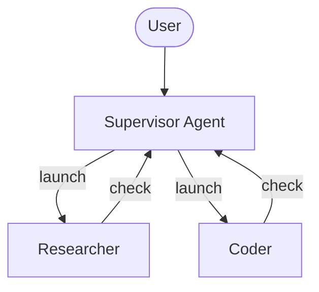
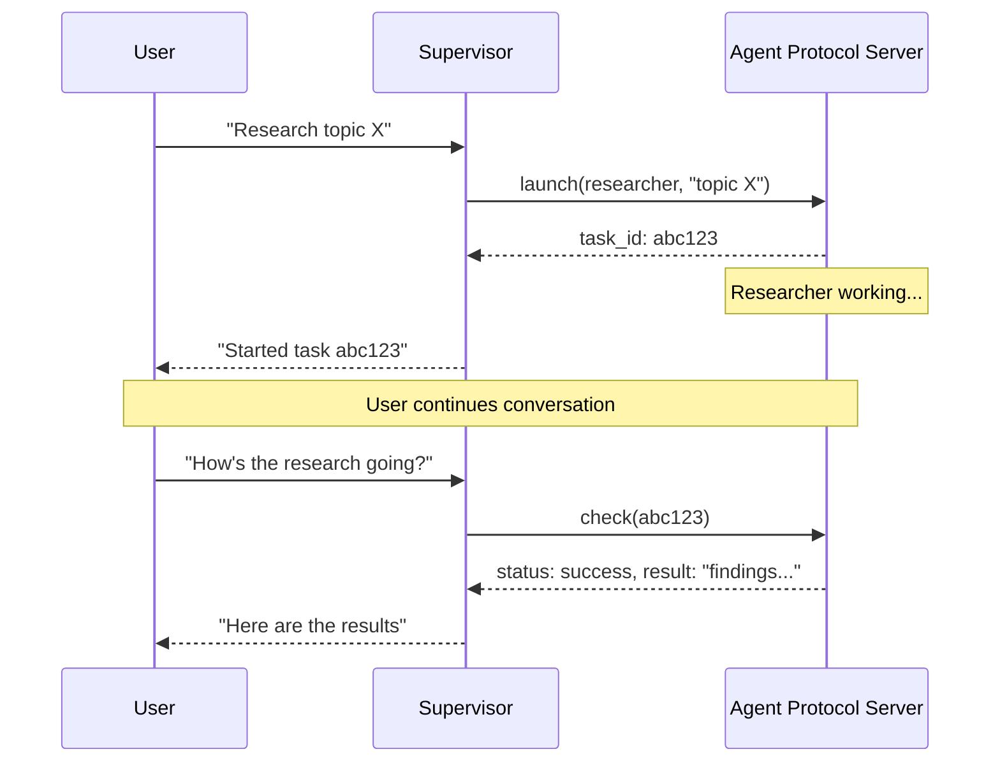

Async subagents 允许 supervisor agent 启动会立即返回的后台任务，这样 supervisor 可以在 subagents 并发工作时继续与用户交互。supervisor 可以随时检查进度、发送后续指令，或取消任务。

这建立在 [subagents](/oss/javascript/deepagents/subagents) 之上；普通 subagents 是同步运行的，会阻塞 supervisor 直到完成。当任务运行时间较长、可并行化，或需要在执行过程中进行引导时，请使用 async subagents。

<Note>


Async subagents 是 `deepagents` 1.9.0 中提供的 preview feature。Preview features 正在积极开发中，API 可能会变化。

</Note>



<Note>
Async subagents 可以与任何实现了 [Agent Protocol](https://github.com/langchain-ai/agent-protocol) 的 server 通信。你可以使用 [LangSmith Deployments](/langsmith/deployment)，也可以 self-host 任何兼容 Agent Protocol 的 server。每个 subagent 都独立于 supervisor 运行，supervisor 通过 SDK 控制它们的 launch、check、update 和 cancel。
</Note>

## 何时使用 async subagents {#when-to-use-async-subagents}

| 维度 | Sync subagents | Async subagents |
|----------------------|-----------------------------------------------------------------|-------------------------------------------------------------------|
| **Execution model** | Supervisor 阻塞直到 subagent 完成 | 立即返回 job ID；supervisor 继续运行 |
| **Concurrency** | 并行但阻塞 | 并行且非阻塞 |
| **Mid-task updates** | 不支持 | 通过 `update_async_task` 发送后续指令 |
| **Cancellation** | 不支持 | 通过 `cancel_async_task` 取消正在运行的任务 |
| **Statefulness** | 无状态，不在调用之间保留持久状态 | 有状态，在自己的 thread 上跨交互维护状态 |
| **Best for** | agent 应等待结果再继续的任务 | 在 chat 中交互式管理的长时间复杂任务 |

## 配置 async subagents {#configure-async-subagents}

将 async subagents 定义为一组 [`AsyncSubAgent`](https://reference.langchain.com/javascript/deepagents/agent/createDeepAgent) specs，每个 spec 都指向一个 Agent Protocol server：


```typescript
import { createDeepAgent, AsyncSubAgent } from "deepagents";

const asyncSubagents: AsyncSubAgent[] = [
  {
    name: "researcher",
    description: "Research agent for information gathering and synthesis",
    graphId: "researcher",
    // No url -> ASGI transport (co-deployed in the same deployment)
  },
  {
    name: "coder",
    description: "Coding agent for code generation and review",
    graphId: "coder",
    // url: "https://coder-deployment.langsmith.dev"  // Optional: HTTP transport for remote
  },
];

const agent = createDeepAgent({
  model: "google_genai:gemini-3.5-flash",
  subagents: [...asyncSubagents],
});
```

| 字段 | 类型 | 说明 |
|-------|------|-------------|
| `name` | `string` | 必填。唯一标识符。supervisor 启动任务时会使用它。 |
| `description` | `string` | 必填。说明这个 subagent 做什么。supervisor 用它判断要 delegate 给哪个 agent。 |
| `graphId` | `string` | 必填。Agent Protocol server 上的 graph ID（或 assistant ID）。对于基于 LangGraph 的 deployments，它必须匹配 `langgraph.json` 中注册的 graph。 |
| `url` | `string` | 可选。省略时使用 ASGI transport（in-process）。设置后使用 HTTP transport 连接远程 Agent Protocol server。 |
| `headers` | `Record<string, string>` | 可选。发往远程 server 的额外 headers。可用于 self-hosted Agent Protocol servers 的自定义 authentication。 |


对于基于 LangGraph 的 deployments，如果采用 co-deployed 设置，请在同一个 `langgraph.json` 中注册所有 graphs：

```json
{
  "graphs": {
    "supervisor": "./src/supervisor.py:graph",
    "researcher": "./src/researcher.py:graph",
    "coder": "./src/coder.py:graph"
  }
}
```

## 使用 async subagent tools {#use-the-async-subagent-tools}

[`AsyncSubAgentMiddleware`](https://reference.langchain.com/javascript/deepagents/agent/createDeepAgent) 会向 supervisor 提供五个 tools：

| 工具 | 用途 | 返回值 |
|------|---------|---------|
| `start_async_task` | 启动新的后台任务 | Task ID（立即返回） |
| `check_async_task` | 获取任务当前状态和结果 | 状态 + 结果（如果已完成） |
| `update_async_task` | 向正在运行的任务发送新指令 | 确认 + 更新后的状态 |
| `cancel_async_task` | 停止正在运行的任务 | 确认 |
| `list_async_tasks` | 列出所有已跟踪任务及实时状态 | 所有任务的摘要 |

supervisor 的 LLM 会像调用其他 tool 一样调用这些 tools。middleware 会自动处理 thread 创建、run 管理和 state 持久化。

### 理解 lifecycle {#understand-the-lifecycle}

典型交互遵循如下序列：



- **Launch** 会在 server 上创建一个新 thread，用任务描述作为输入启动 run，并将 thread ID 作为 task ID 返回。supervisor 会把这个 ID 报告给用户，并且不会轮询完成状态。
- **Check** 会获取当前 run status。如果 run 成功，它会检索 thread state 以提取 subagent 的最终输出。如果仍在运行，则向用户报告这一点。
- **Update** 会在同一 thread 上创建新的 run，并使用 interrupt multitask strategy。前一个 run 会被中断，subagent 会带着完整 conversation history 加上新指令重新开始。task ID 保持不变。
- **Cancel** 会在 server 上调用 `runs.cancel()`，并将任务标记为 `"cancelled"`。
- **List** 会遍历所有已跟踪任务。对于非终态任务，它会并行从 server 获取实时 status。终态 status（`success`、`error`、`cancelled`）会从 cache 返回。

## 理解 state management {#understand-state-management}


Task metadata 存储在 supervisor graph 的专用 state channel（`asyncTasks`）中，与 message history 分离。这一点很关键，因为当 context window 填满时，deep agents 会[压缩它们的 message history](/oss/javascript/deepagents/context-engineering#summarization)。如果 task ID 只存在于 tool messages 中，它们会在 compaction 期间丢失。专用 channel 确保 supervisor 即使经过多轮 summarization 后，也始终能通过 `list_async_tasks` 回忆起自己的任务。

每个被跟踪的 task 都会记录 task ID、agent name、thread ID、run ID、status 和 timestamps（`createdAt`、`checkedAt`、`updatedAt`）。


## 选择 transport {#choose-a-transport}

### ASGI transport（co-deployed） {#asgi-transport-co-deployed}

当 subagent spec 省略 `url` field 时，LangGraph SDK 会使用 ASGI transport，也就是 SDK calls 会通过 in-process function calls 路由，而不是通过 HTTP。对于基于 LangGraph 的 deployments，这要求两个 graphs 都注册在同一个 `langgraph.json` 中。

ASGI transport 消除了网络延迟，也不需要额外的 auth 配置。subagent 仍会作为独立 thread 运行，并拥有自己的 state。这是推荐的默认方式。

### HTTP transport（remote） {#http-transport-remote}

添加 `url` field 可切换到 HTTP transport，此时 SDK calls 会通过网络发送到远程 Agent Protocol server：


```typescript
{
  name: "researcher",
  description: "Research agent",
  graphId: "researcher",
  url: "https://my-research-deployment.langsmith.dev",
}
```


对于 LangGraph deployments，authentication 由 LangGraph SDK 使用环境变量中的 `LANGSMITH_API_KEY`（或 `LANGGRAPH_API_KEY`）处理。Self-hosted Agent Protocol servers 可能使用不同的 authentication 机制。

当 subagents 需要独立扩缩容、不同 resource profiles，或由不同团队维护时，请使用 HTTP transport。

## 选择 deployment topology {#choose-a-deployment-topology}

### 单一 deployment {#single-deployment}

Single deployment 表示所有 agents 都使用 ASGI transport co-deployed 在同一个 server 上。对于基于 LangGraph 的 deployments，请在一个 `langgraph.json` 中注册所有 graphs。这是推荐的起点：只需管理一个 server，agents 之间零网络延迟。

### 拆分 deployment {#split-deployment}

Supervisor 在一个 server 上，subagents 通过 HTTP transport 放在另一个 server 上。当 subagents 需要不同 compute profiles 或独立扩缩容时使用。

### 混合模式 {#hybrid}

在 hybrid deployment 中，一些 subagents 通过 ASGI co-deployed，另一些通过 HTTP 远程运行：


```typescript
const asyncSubagents: AsyncSubAgent[] = [
  {
    name: "researcher",
    description: "Research agent",
    graphId: "researcher",
    // No url -> ASGI (co-deployed)
  },
  {
    name: "coder",
    description: "Coding agent",
    graphId: "coder",
    url: "https://coder-deployment.langsmith.dev",
    // url present -> HTTP (remote)
  },
];
```


## 最佳实践 {#best-practices}

### 为本地开发设置合适的 worker pool 大小 {#size-the-worker-pool-for-local-development}

使用 `langgraph dev` 本地运行时，请增大 worker pool 以容纳并发的 subagent runs。每个 active run 都会占用一个 worker slot。一个带有 3 个并发 subagent tasks 的 supervisor 需要 4 个 slots（1 个 supervisor + 3 个 subagents）。资源不足会导致 launch 排队。

```bash
langgraph dev --n-jobs-per-worker 10
```

### 编写清晰的 subagent descriptions {#write-clear-subagent-descriptions}

supervisor 使用 descriptions 判断要启动哪个 subagent。请具体、面向动作地描述：


```typescript
// Good
{
  name: "researcher",
  description: "Conducts in-depth research using web search. Use for questions requiring multiple searches and synthesis.",
  graphId: "researcher",
}

// Bad
{
  name: "helper",
  description: "helps with stuff",
  graphId: "helper",
}
```


### 用 thread IDs 追踪 {#trace-with-thread-ids}

使用基于 LangGraph 的 deployments 时，每个 async subagent run 都是标准 LangGraph run，并在 LangSmith 中完全可见。supervisor 的 trace 会显示 `launch`、`check`、`update`、`cancel` 和 `list` 的 tool calls。每个 subagent run 都会作为单独 trace 出现，并通过 thread ID 关联。使用 thread ID（task ID）可以将 supervisor orchestration traces 与 subagent execution traces 对应起来。

## 故障排除 {#troubleshooting}

### Supervisor 在 launch 后立即轮询 {#supervisor-polls-immediately-after-launch}

**Problem**：supervisor 在 launch 后立刻循环调用 `check`，把 async execution 变成了阻塞执行。

**Solution**：middleware 会注入 system prompt rules 来防止这种情况。如果仍然轮询，请在 supervisor 的 system prompt 中强化这个行为：


```typescript
const agent = createDeepAgent({
  model: "google_genai:gemini-3.5-flash",
  systemPrompt: `...your instructions...

    After launching an async subagent, ALWAYS return control to the user.
    Never call check_async_task immediately after launch.`,
  subagents: [...asyncSubagents],
});
```


### Supervisor 报告过期 status {#supervisor-reports-stale-status}

**Problem**：supervisor 引用了 conversation history 中较早的 task status，而没有发起新的 `check` 调用。

**Solution**：middleware prompt 会指示 model：“conversation history 中的 task statuses 总是过期的。”如果仍出现这种情况，请添加明确指令，要求在报告 status 前始终调用 `check` 或 `list`。

### Task ID 查找失败 {#task-id-lookup-failures}

**Problem**：supervisor 截断或重新格式化 task ID，导致 `check` 或 `cancel` 失败。

**Solution**：middleware prompt 会指示 model 始终使用完整 task ID。如果仍然截断，这通常是 model-specific 问题；请尝试另一个 model，或在 system prompt 中加入“always show the full task_id, never truncate or abbreviate it”。

### Subagent launch 排队而不是运行 {#subagent-launches-queue-instead-of-running}

**Problem**：启动 subagent 时卡住，或需要很长时间才开始。

**Solution**：worker pool 可能已经耗尽。用 `--n-jobs-per-worker` 增大 pool size。参见[设置 worker pool 大小](#size-the-worker-pool-for-local-development)。

## 参考实现 {#reference-implementation}

[async-deep-agents](https://github.com/langchain-ai/async-deep-agents) repository 包含 Python 和 TypeScript 的可运行示例，并可部署到 LangSmith Deployments。它展示了一个 supervisor 搭配 researcher 和 coder subagents 作为后台任务运行。

---

<div className="source-links">
<Callout icon="terminal-2">
    [Connect these docs](/use-these-docs) to Claude, VSCode, and more via MCP for real-time answers.
</Callout>
<Callout icon="edit">
    [Edit this page on GitHub](https://github.com/langchain-ai/docs/edit/main/src/oss/deepagents/async-subagents.mdx) or [file an issue](https://github.com/langchain-ai/docs/issues/new/choose).
</Callout>
</div>
