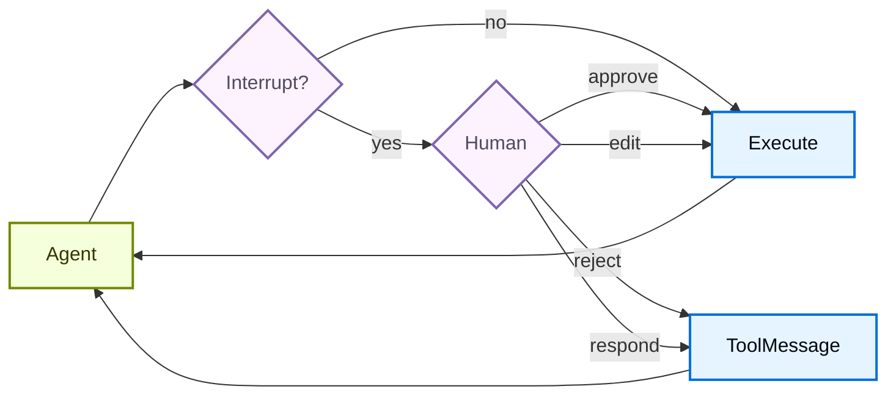

import HitlBasicConfigPy from '/snippets/code-samples/hitl-basic-config-py.mdx';
import HitlBasicConfigJs from '/snippets/code-samples/hitl-basic-config-js.mdx';

某些 tool 操作可能比较敏感，需要在执行前获得人工审批。Deep Agents 通过 LangGraph 的 interrupt capabilities 支持 human-in-the-loop workflows。你可以使用 `interrupt_on` 参数配置哪些 tools 需要审批。



## 基本配置 {#basic-configuration}

`interrupt_on` 参数接受一个 dictionary，将 tool names 映射到 interrupt configurations。每个 tool 都可以这样配置：

- **`True`**：启用 interrupts，并使用默认行为（允许 approve、edit、reject、respond）
- **`False`**：禁用这个 tool 的 interrupts
- **`{"allowed_decisions": [...]}`**：使用指定 allowed decisions 的自定义配置


<HitlBasicConfigJs />


## 决策类型 {#decision-types}

`allowed_decisions` list 控制人工 review 一个 tool call 时可以采取哪些动作：

- **`"approve"`**：使用 agent 提议的原始 arguments 执行 tool
- **`"edit"`**：在执行前修改 tool arguments
- **`"reject"`**：完全跳过这个 tool call，不执行
- **`"respond"`**：直接将人工消息作为 tool result 返回并跳过执行，适用于“ask user”风格的 tools

你可以为每个 tool 自定义可用 decisions：


```typescript
const interruptOn = {
  // Sensitive operations: allow all options
  delete_file: { allowedDecisions: ["approve", "edit", "reject"] },

  // Moderate risk: approval or rejection only
  write_file: { allowedDecisions: ["approve", "reject"] },

  // Must approve (no rejection allowed)
  critical_operation: { allowedDecisions: ["approve"] },
};
```


## 处理中断 {#handle-interrupts}

当 interrupt 被触发时，agent 会暂停执行并交还控制权。检查结果中是否有 interrupts，并据此处理。


```typescript
import { v7 as uuid7 } from "uuid";
import { Command } from "@langchain/langgraph";

// Create config with thread_id for state persistence
const config = { configurable: { thread_id: uuid7() } };

// Invoke the agent
let result = await agent.invoke({
  messages: [{ role: "user", content: "Delete the file temp.txt" }],
}, config);

// Check if execution was interrupted
if (result.__interrupt__) {
  // Extract interrupt information
  const interrupts = result.__interrupt__[0].value;
  const actionRequests = interrupts.actionRequests;
  const reviewConfigs = interrupts.reviewConfigs;

  // Create a lookup map from tool name to review config
  const configMap = Object.fromEntries(
    reviewConfigs.map((cfg) => [cfg.actionName, cfg])
  );

  // Display the pending actions to the user
  for (const action of actionRequests) {
    const reviewConfig = configMap[action.name];
    console.log(`Tool: ${action.name}`);
    console.log(`Arguments: ${JSON.stringify(action.args)}`);
    console.log(`Allowed decisions: ${reviewConfig.allowedDecisions}`);
  }

  // Get user decisions (one per actionRequest, in order)
  const decisions = [
    { type: "approve" }  // User approved the deletion
  ];

  // Resume execution with decisions
  result = await agent.invoke(
    new Command({ resume: { decisions } }),
    config  // Must use the same config!
  );
}

// Process final result
console.log(result.messages[result.messages.length - 1].content);
```


## 多个工具调用 {#multiple-tool-calls}

当 agent 调用多个需要审批的 tools 时，所有 interrupts 会被批处理到一个 interrupt 中。你必须按顺序为每个 action 提供 decisions。


```typescript
const config = { configurable: { thread_id: uuid7() } };

let result = await agent.invoke({
  messages: [{
    role: "user",
    content: "Delete temp.txt and send an email to admin@example.com"
  }]
}, config);

if (result.__interrupt__) {
  const interrupts = result.__interrupt__[0].value;
  const actionRequests = interrupts.actionRequests;

  // Two tools need approval
  console.assert(actionRequests.length === 2);

  // Provide decisions in the same order as actionRequests
  const decisions = [
    { type: "approve" },  // First tool: delete_file
    { type: "reject" }    // Second tool: send_email
  ];

  result = await agent.invoke(
    new Command({ resume: { decisions } }),
    config
  );
}
```


## 编辑工具参数 {#edit-tool-arguments}

当 allowed decisions 中包含 `"edit"` 时，你可以在执行前修改 tool arguments：


```typescript
if (result.__interrupt__) {
  const interrupts = result.__interrupt__[0].value;
  const actionRequest = interrupts.actionRequests[0];

  // Original args from the agent
  console.log(actionRequest.args);  // { to: "everyone@company.com", ... }

  // User decides to edit the recipient
  const decisions = [{
    type: "edit",
    editedAction: {
      name: actionRequest.name,  // Must include the tool name
      args: { to: "team@company.com", subject: "...", body: "..." }
    }
  }];

  result = await agent.invoke(
    new Command({ resume: { decisions } }),
    config
  );
}
```


## Subagent 中断 {#subagent-interrupts}

使用 subagents 时，你可以使用 [tool calls 上的 interrupts](#interrupts-on-tool-calls) 和 [tool calls 内部的 interrupts](#interrupts-within-tool-calls)。

### 工具调用上的中断 {#interrupts-on-tool-calls}

每个 subagent 都可以有自己的 `interrupt_on` 配置，用来覆盖 main agent 的设置：


```typescript
const agent = createDeepAgent({
  tools: [deleteFile, readFile],
  interruptOn: {
    delete_file: true,
    read_file: false,
  },
  subagents: [{
    name: "file-manager",
    description: "Manages file operations",
    systemPrompt: "You are a file management assistant.",
    tools: [deleteFile, readFile],
    interruptOn: {
      // Override: require approval for reads in this subagent
      delete_file: true,
      read_file: true,  // Different from main agent!
    }
  }],
  checkpointer
});
```


当 subagent 触发 interrupt 时，处理方式相同：检查 result 上的 `interrupts`，并用 `Command` resume。

### 工具调用内部的中断 {#interrupts-within-tool-calls}

Subagent tools 可以直接调用 `interrupt()` 来暂停执行并等待审批：


```typescript
import { createAgent, tool } from "langchain";
import { ChatOpenAI } from "@langchain/openai";
import { HumanMessage } from "@langchain/core/messages";
import { MemorySaver, Command, interrupt } from "@langchain/langgraph";
import { createDeepAgent } from "deepagents";
import { z } from "zod";

const requestApproval = tool(
  async ({ actionDescription }: { actionDescription: string }) => {
    const approval = interrupt({
      type: "approval_request",
      action: actionDescription,
      message: `Please approve or reject: ${actionDescription}`,
    }) as { approved?: boolean; reason?: string };

    if (approval.approved) {
      return `Action '${actionDescription}' was APPROVED. Proceeding...`;
    } else {
      return `Action '${actionDescription}' was REJECTED. Reason: ${
        approval.reason || "No reason provided"
      }`;
    }
  },
  {
    name: "request_approval",
    description: "Request human approval before proceeding with an action.",
    schema: z.object({
      actionDescription: z
        .string()
        .describe("The action that requires approval"),
    }),
  }
);

async function main() {
  const checkpointer = new MemorySaver();
  const model = new ChatOpenAI({
    model: "gpt-4o-mini",
    maxTokens: 4096,
  });

  const compiledSubagent = createAgent({
    model: model,
    tools: [requestApproval],
    name: "approval-agent",
  });

  const parentAgent = await createDeepAgent({
    checkpointer: checkpointer,
    subagents: [
      {
        name: "approval-agent",
        description: "An agent that can request approvals",
        runnable: compiledSubagent as any,
      },
    ],
  });

  const threadId = "test_interrupt_directly";
  const config = { configurable: { thread_id: threadId } };

  console.log("Invoking agent - sub-agent will use request_approval tool...");

  let result = await parentAgent.invoke(
    {
      messages: [
        new HumanMessage({
          content:
            "Use the task tool to launch the approval-agent sub-agent. " +
            "Tell it to use the request_approval tool to request approval for 'deploying to production'.",
        }),
      ],
    },
    config
  );

  if (result.__interrupt__) {
    const interruptValue = result.__interrupt__[0].value as {
      type?: string;
      action?: string;
      message?: string;
    };
    console.log("\nInterrupt received!");
    console.log(`  Type: ${interruptValue.type}`);
    console.log(`  Action: ${interruptValue.action}`);
    console.log(`  Message: ${interruptValue.message}`);

    console.log("\nResuming with Command(resume={'approved': true})...");
    const result2 = await parentAgent.invoke(
      new Command({ resume: { approved: true } }),
      config
    );

    if (!result2.__interrupt__) {
      console.log("\nExecution completed!");
      // Find the tool response
      const toolMsgs = result2.messages?.filter((m) => m.type === "tool") || [];
      if (toolMsgs.length > 0) {
        const lastToolMsg = toolMsgs[toolMsgs.length - 1];
        console.log(`  Tool result: ${lastToolMsg.content}`);
      }
    } else {
      console.log("\nAnother interrupt occurred");
    }
  } else {
    console.log(
      "\n  No interrupt - the model may not have called request_approval"
    );
  }
}

main().catch(console.error);
```

运行时会生成以下输出：

```typescript
Invoking agent - sub-agent will use request_approval tool...

Interrupt received!
  Type: approval_request
  Action: deploying to production
  Message: Please approve or reject: deploying to production

Resuming with Command(resume={'approved': true})...

Execution completed!
  Tool result: Approval for "deploying to production" has been granted. You can proceed with the deployment.
```


## 最佳实践 {#best-practices}

### 始终使用 checkpointer {#always-use-a-checkpointer}

Human-in-the-loop 需要 checkpointer 来在 interrupt 与 resume 之间持久化 agent state：


### 使用相同 thread ID {#use-the-same-thread-id}

resume 时，你必须使用带有相同 `thread_id` 的同一个 config：


### 让 decision 顺序匹配 action 顺序 {#match-decision-order-to-actions}

decisions list 必须与 `action_requests` 的顺序一致：


### 按风险定制配置 {#tailor-configurations-by-risk}

根据不同 tool 的风险等级配置它们：

---

<div className="source-links">
<Callout icon="terminal-2">
    [Connect these docs](/use-these-docs) to Claude, VSCode, and more via MCP for real-time answers.
</Callout>
<Callout icon="edit">
    [Edit this page on GitHub](https://github.com/langchain-ai/docs/edit/main/src/oss/deepagents/human-in-the-loop.mdx) or [file an issue](https://github.com/langchain-ai/docs/issues/new/choose).
</Callout>
</div>
