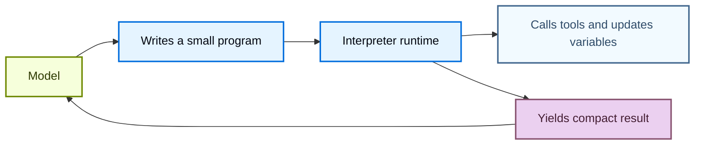
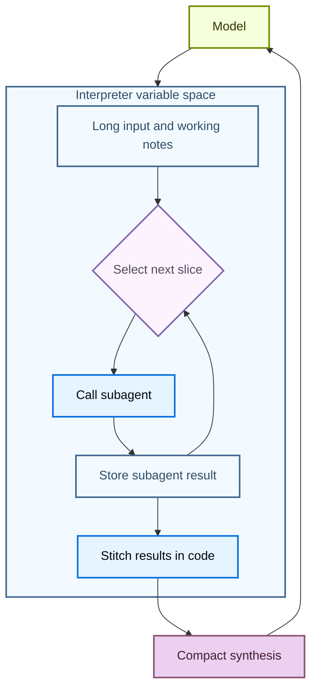

Interpreters 为 agents 提供一个可编程 workspace，让它们可以探索数据、协调 tool calls，并把中间工作保留在 model context 之外。agent 会编写代码来表达意图，然后由 **in-memory** runtime 执行这些代码并返回相关结果。

[sandboxes](/oss/javascript/deepagents/sandboxes) 是一种 code-first 的方式，用于作用于某个 environment（例如运行命令、安装 dependencies、编辑文件）；而 interpreters 是一种 code-first 的方式，用于作用在 agent loop 内部：组合 tools、保留 state，并决定哪些信息应返回给 model。

<Warning>
    Interpreters 是 experimental。API 和 lifecycle 行为可能在不同 release 之间变化。
</Warning>


## 何时使用 interpreter {#when-to-use-an-interpreter}

大多数 agent 工作会在 model reasoning 和 tool execution 之间交替。对于简单动作，这种方式没问题；但当 agent 需要组合多个步骤、对 structured data 进行 reasoning，或管理 intermediate state 时，它会变得笨重。

interpreter 会给 agent 一个用于这类工作的 runtime。agent 不必要求 model 每次只选择下一步的一个 tool call，而是可以写一个小程序来执行 control flow、调用 allowlisted tools、存储 variables，并向 model 返回紧凑结果。

当 agent 需要做这些事时，请使用 interpreters：

- 用代码组合多个 tool calls，包括 loops、branching、retries 和 concurrency。
- 从代码协调 subagents：把工作拆分成聚焦的 calls、存储它们的结果，再把这些结果拼接成最终 synthesis。
- 把 intermediate values 保存在 runtime state 中，而不是把每个临时结果都送回 model context。
- 确定性地转换 structured data，例如 sorting、grouping、parsing、validating、scoring 或 aggregating。
- 探索较大的 variable space，并只向 model 返回选定的 evidence、summaries 或 outputs。



这通过在 [**QuickJS**](https://github.com/quickjs-ng/quickjs) 上运行代码实现。QuickJS 是一个轻量级 JavaScript runtime，专为 embedded execution 设计。默认情况下，runtime 会给 agent 一个可执行代码的位置，同时不会暴露 host filesystem、network、shell、package 或 clock APIs。

QuickJS 是 interpreter code 的执行边界。显式 bridges（例如 programmatic tool calling）会决定代码可以访问哪些 capabilities。

## 选择合适的执行路径 {#choose-the-right-execution-path}

| 需求 | 使用方式 |
| --- | --- |
| 一两个简单的外部调用 | Normal tool calling |
| 一个带有 loops、branches、retries 或聚合逻辑的小程序 | Interpreter |
| 需要从代码运行的多个选定 tool calls | 带 programmatic tool calling 的 Interpreter |
| 跨 threads 复用的 helpers | 带 [interpreter skills](/oss/javascript/deepagents/skills#use-interpreter-skills) 的 Interpreter |
| Shell commands、package installs、tests，或完整 OS filesystem access | [Sandboxes](/oss/javascript/deepagents/sandboxes) |

## 向 agent 添加 interpreter {#add-an-interpreter-to-an-agent}

先安装 QuickJS middleware package，然后在创建 agent 时添加 middleware。


<CodeGroup>
```bash npm
npm install deepagents @langchain/quickjs
```

```bash pnpm
pnpm add deepagents @langchain/quickjs
```

```bash yarn
yarn add deepagents @langchain/quickjs
```
</CodeGroup>

```typescript
import { createDeepAgent } from "deepagents";
import { createCodeInterpreterMiddleware } from "@langchain/quickjs";

const agent = createDeepAgent({
  model: "openai:gpt-5.4",
  middleware: [createCodeInterpreterMiddleware()],
});
```


## 在 interpreter 中运行代码 {#run-code-in-the-interpreter}

middleware 会向 agent 添加一个 `eval` tool。该 tool 会在持久化 context 中运行 TypeScript，捕获 `console.log`，并返回最后一个 expression 的结果。

agent 可以编写这样的代码：

```javascript
const rows = [
  { team: "alpha", score: 8 },
  { team: "beta", score: 13 },
  { team: "alpha", score: 21 },
];

const totals = rows.reduce((acc, row) => {
  acc[row.team] = (acc[row.team] ?? 0) + row.score;
  console.log(`${row.team} score: ${acc[row.team]}`)
  return acc;
}, {});

totals;
```


## 编程式 tool calling {#programmatic-tool-calling}

Programmatic tool calling（PTC）会把选定的 agent tools 暴露到 interpreter 的全局 `tools` namespace 下。agent 不必要求 model 发出一个 tool call、等待结果、再决定下一个调用，而是可以写代码在 loops、branches、retries 或 parallel batches 中调用 tools。

当 intermediate tool results 只是下一步的输入时，这很有用。interpreter 可以在任何内容返回 model context 之前处理、过滤或聚合这些结果，从而让 multi-tool/multi-step workflows 更节省 tokens。

Deep Agents 中的 PTC 与 model 无关。它由 middleware 实现，而不是 provider-specific 的 code-execution 或 tool-calling API。

### 工作原理 {#how-it-works}

1. 你用 `ptc` allowlist 选择 interpreter 可以调用哪些 tools。
2. middleware 将这些 tools 作为 async JavaScript functions 暴露在 `tools` 下。
3. agent 编写 interpreter code，并用 `await` 调用这些 functions。
4. interpreter 运行 tool bridge，接收 tool result，并继续执行代码。
5. model 收到最终的 interpreter output，而不是每个 intermediate value。

每个 allowlisted tool 都会变成一个 async function。Tool names 会转换成 camel case，但 input object 仍遵循该 tool 的 schema。例如，名为 `web_search` 的 tool 会变成 `tools.webSearch(...)`：

```typescript
const result: string = await tools.webSearch({
  query: "deepagents interpreters",
});
```

### 常用模式 {#useful-patterns}

| **Pattern** | **What the interpreter can do** |
| --- | --- |
| Batch processing | 遍历大量 inputs，并为每个 input 调用 tool。 |
| Parallel work | 对独立调用使用 `Promise.all`。 |
| Conditional logic | 根据之前的结果选择下一个 tool call。 |
| Early termination | 一旦满足成功条件就停止调用 tools。 |
| Data filtering | 只向 model 返回相关 rows、snippets、errors 或 summaries。 |
| Recursive orchestration | 反复调用 `task`，然后在代码中合并 subagent results。 |

### 启用 PTC {#enable-ptc}

使用显式 allowlist 启用 PTC：


```typescript
import { createDeepAgent } from "deepagents";
import { createCodeInterpreterMiddleware } from "@langchain/quickjs";

const agent = createDeepAgent({
  model: "openai:gpt-5.4",
  middleware: [createCodeInterpreterMiddleware({ ptc: ["task"] })],
});
```


启用 PTC 后，agent 可以从 interpreter code 调用 allowlisted tool。这个例子会并行启动多个 subagents，并在返回给 model 前合并它们的最终 reports：

```javascript
const topics = ["retrieval", "memory", "evaluation"];

const reports = await Promise.all(
  topics.map((topic) =>
    tools.task({
      description: `Research ${topic} in Deep Agents and return three concise findings.`,
      subagent_type: "general-purpose",
    }),
  ),
);

reports.join("\n\n");
```

因为这是代码，agent 也可以在本地处理 failures：

```javascript
try {
  const report = await tools.task({
    description: "Check the migration notes and return breaking changes.",
    subagent_type: "general-purpose",
  });
  console.log(report);
} catch (error) {
  console.log(`Subagent failed: ${error.message}`);
}
```

<Warning>
    PTC calls 目前通过 interpreter bridge 执行，不会经过 normal tool calling path。因此，`interrupt_on` approval workflows 不会按每个由 PTC 调用的 tool call 强制执行。
</Warning>

## 递归语言模型 {#recursive-language-models}

Recursive language models 使用 interpreter 作为用于 decomposition 的 workspace。model 会把大型 input 或 working set 保存在 runtime variables 中，编写代码来检查并拆分它，调用 subagents 或其他 model tools 处理较小片段，然后在代码中拼接返回结果。

这会把 variable space 与 agent 的 context 分离。variable space 是存储在 interpreter 中的信息，而 agent 的 context 是 model 在下一次 model call 中实际处理的内容。model 可以决定哪些 snippets 变成 subagent tasks、哪些 results 需要再处理一轮，以及最终 synthesis 应返回到主对话中的内容。



关于这种模式的背景，请参见 [Recursive Language Models paper](https://arxiv.org/abs/2512.24601)。

在 Deep Agents 中，recursive call 通常是通过 programmatic tool calling 暴露的 `task` tool。interpreter 可以对许多 slices 调用 subagents，合并它们的 answers，并返回一个合成后的结果：

```javascript
const candidates = notes
  .filter((note) => note.includes("migration"))
  .slice(0, 5);

const riskReports = await Promise.all(
  candidates.map((note) =>
    tools.task({
      description: `Analyze this migration note for release risk. Return risks, affected users, and recommended follow-up:\n\n${note}`,
      subagent_type: "general-purpose",
    }),
  ),
);

const releaseSummary = riskReports
  .map((report, index) => `## Candidate ${index + 1}\n${report}`)
  .join("\n\n");

releaseSummary;
```

## Interpreter skills {#interpreter-skills}

Interpreter skills 是向 interpreter 暴露 code modules 的 [skills](/oss/javascript/deepagents/skills)。配置 interpreter middleware 后，agent 可以从代码中 import 这些 modules，并将其用于确定性的 helper logic。

当 agent 需要为 structured data workflows 复用 helpers（例如 sorting、grouping、scoring、parsing、validating 或 aggregating data）时，interpreter skills 很有用。设置细节请参见 [Interpreter skills](/oss/javascript/deepagents/skills#use-interpreter-skills)。


## 安全和限制 {#security-and-limits}

Interpreters 使用 QuickJS 运行不可信 JavaScript，并采用严格的默认 isolation。请把它视为一个 capability-scoped interpreter runtime，而不是完整的 production sandbox backend。

通过 PTC 暴露的每个 tool 都是 interpreter code 可以使用的外部 capability。请把 PTC allowlist 视为 permission boundary：只暴露 agent 需要的 tools，并避免桥接可以访问敏感系统、花费金钱、修改数据或调用 unrestricted networks 的宽泛 tools，除非这些行为是有意设计的。


| 能力 | 默认可用 | 如何暴露 |
| --- | --- | --- |
| JavaScript execution | Yes | 添加 interpreter middleware |
| Top-level `await` | Yes | 在 interpreter code 中使用 promises |
| `console.log` capture | Yes | 用 `captureConsole: false` 禁用 |
| Agent tools | No | 添加 PTC allowlist |
| Interpreter skill modules | No | 添加 `module` entry，并配置 `skills_backend` 或 `skillsBackend` |
| Filesystem access | No | 通过 PTC allowlist 添加 [built-in filesystem tools](/oss/javascript/deepagents/harness#virtual-filesystem-access) |
| Network access | No | 通过 PTC 暴露一个具体 network tool |
| Wall-clock or datetime access | No | 如有需要，暴露一个显式 time tool |
| Shell commands、package installs、tests、OS-level execution | No | 使用 [sandbox backend](/oss/javascript/deepagents/sandboxes) |


## Middleware 选项 {#middleware-options}


`createCodeInterpreterMiddleware` 接受以下 options：

| 选项 | 默认值 | 用途 |
| --- | --- | --- |
| `ptc` | omitted | PTC allowlist：tool names 或 `StructuredToolInterface` instances 的数组。 |
| `memoryLimitBytes` | `64 * 1024 * 1024` <br/>(64 MB) | QuickJS memory limit，单位为 bytes。 |
| `maxStackSizeBytes` | `320 * 1024` | QuickJS stack size limit，单位为 bytes。 |
| `executionTimeoutMs` | `5000` | 每次 eval 的 timeout，单位为 milliseconds。负值会禁用 timeout。 |
| `systemPrompt` | `null` | 覆盖 built-in interpreter system prompt。 |
| `skillsBackend` | omitted | 用于解析 interpreter skill modules 的 backend。 |
| `maxPtcCalls` | `256` | 每次 eval 允许的最大 `tools.*` calls 数量。只有在可信环境中才使用 `null`。 |
| `maxResultChars` | `4000` | 从 console output、result 和 error strings 中保留的最大字符数。 |
| `toolName` | `"eval"` | 暴露给 model 的 interpreter tool 名称。 |
| `captureConsole` | `true` | 是否捕获 `console.log`、`console.warn` 和 `console.error` 输出。 |

---

<div className="source-links">
<Callout icon="terminal-2">
    [Connect these docs](/use-these-docs) to Claude, VSCode, and more via MCP for real-time answers.
</Callout>
<Callout icon="edit">
    [Edit this page on GitHub](https://github.com/langchain-ai/docs/edit/main/src/oss/deepagents/interpreters.mdx) or [file an issue](https://github.com/langchain-ai/docs/issues/new/choose).
</Callout>
</div>
