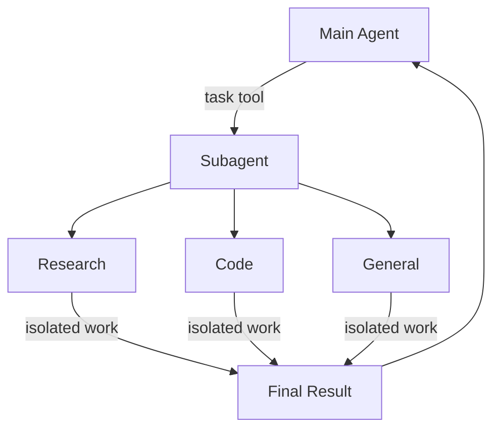

import SubagentBasicPy from '/snippets/code-samples/subagent-basic-py.mdx';
import SubagentBasicJs from '/snippets/code-samples/subagent-basic-js.mdx';

deep agent 可以创建 subagents 来委托工作。你可以通过 `subagents` 参数指定 custom subagents。Subagents 对 [context quarantine](https://www.dbreunig.com/2025/06/26/how-to-fix-your-context.html#context-quarantine) 很有用，也就是保持 main agent 的 context 干净；它们也适合提供专门的 instructions。

本页介绍**同步** subagents：supervisor 会阻塞，直到 subagent 完成。对于 long-running tasks、并行 workstreams，或需要 mid-flight steering 和 cancellation 的场景，请参阅 [Async subagents](/oss/javascript/deepagents/async-subagents)。



## 为什么使用 subagents？ {#why-use-subagents}

Subagents 解决的是 **context bloat problem**。当 agents 使用会产生大型输出的 tools（web search、file reads、database queries）时，context window 会很快被 intermediate results 填满。Subagents 会隔离这些细节工作：main agent 只接收最终结果，而不是生成结果的几十个 tool calls。

**When to use subagents:**
- ✓ 会污染 main agent context 的 multi-step tasks
- ✓ 需要 custom instructions 或 tools 的 specialized domains
- ✓ 需要不同 model capabilities 的 tasks
- ✓ 希望 main agent 专注于 high-level coordination 时

**When NOT to use subagents:**
- ✗ 简单的 single-step tasks
- ✗ 需要保留 intermediate context 时
- ✗ overhead 超过收益时

## 配置 {#configuration}

`subagents` 应该是 dictionaries 或 [`CompiledSubAgent`](https://reference.langchain.com/javascript/deepagents/middleware/CompiledSubAgent) objects 的列表。有两种类型：

### 默认 subagent {#default-subagent}

Deep Agents 会自动添加一个同步的 `general-purpose` subagent，除非你已经提供了同名的同步 subagent。

`general-purpose` subagent 默认拥有 filesystem tools，并且可以用额外 tools/middleware 自定义。

- 如需替换它，请传入你自己的、名为 `general-purpose` 的 subagent。
- 如需重命名或重新设置自动添加版本的 prompt，请在当前 [harness profile](/oss/javascript/deepagents/profiles#harness-profiles) 上设置 `general_purpose_subagent=GeneralPurposeSubagentProfile(...)`。
- 如需禁用它，请参阅下方 [Running without subagents](#running-without-subagents)。

### 不使用 subagents 运行 {#running-without-subagents}

如果要运行一个没有 `task` tool 的 agent，需要做两件事：

1. 在当前 [harness profile](/oss/javascript/deepagents/profiles#harness-profiles) 上设置 `general_purpose_subagent=GeneralPurposeSubagentProfile(enabled=False)`。
2. 在 `create_deep_agent` 上不要通过 `subagents=` 传入同步 subagents。

只有至少存在一个同步 subagent 时，Deep Agents 才会附加 `SubAgentMiddleware`（以及 `task` tool）。如果既没有默认 subagent，也没有调用方提供的 subagent，agent 会在没有 delegation 的情况下运行。

Async subagents 不受影响；它们会经过自己的 middleware 和 tools，详见 [Async subagents](/oss/javascript/deepagents/async-subagents)。

<Tip>
    这里不要使用 `excluded_middleware`；`SubAgentMiddleware` 是必需 scaffolding，把它列进去会抛出 `ValueError`。受支持的方式是使用 `general_purpose_subagent.enabled = False` 这个开关。
</Tip>

## 自定义 subagents {#custom-subagents}

你可以通过 `subagents` 参数定义带特定 tools 的 specialized subagents，例如 code reviewer、web researcher 或 test runner。

大多数场景下，请用 [SubAgent dictionaries](#subagent-dictionary-based) 定义 subagents。对于复杂 workflows，请使用 [`CompiledSubAgent`](#compiledsubagent)：

### SubAgent（dictionary-based） {#subagent-dictionary-based}

把 subagents 定义为符合 [`SubAgent`](https://reference.langchain.com/javascript/deepagents/middleware/SubAgent) spec 的 dictionaries，包含以下字段：


| 字段 | 类型 | 说明 |
|-------|------|-------------|
| `name` | `str` | 必填。subagent 的 unique identifier。main agent 调用 `task()` tool 时会使用这个名称。subagent name 也会成为 `AIMessage`s 和 streaming 的 metadata，帮助区分 agents。 |
| `description` | `str` | 必填。描述这个 subagent 做什么。请具体、action-oriented。main agent 会用它判断何时 delegate。 |
| `system_prompt` | `str` | 必填。subagent 的 instructions。Custom subagents 必须定义自己的 instructions。请包含 tool usage guidance 和 output format requirements。<br></br>不会从 main agent 继承。 |
| `tools` | `list[Callable]` | 可选。subagent 可以使用的 tools。保持最小，只包含必要 tools。<br></br>默认从 main agent 继承。指定时会完全覆盖继承的 tools。 |
| `model` | `str` \| `BaseChatModel` | 可选。覆盖 main agent 的 model。省略则使用 main agent 的 model。<br></br>默认从 main agent 继承。你可以传入 model identifier string，例如 `'openai:gpt-5.4'`（使用 `'provider:model'` 格式），也可以传 LangChain chat model object（`await initChatModel("gpt-5.4")` 或 `new ChatOpenAI({ model: "gpt-5.4" })`）。 |
| `middleware` | `list[Middleware]` | 可选。用于 custom behavior、logging 或 rate limiting 的额外 middleware。<br></br>不会从 main agent 继承。 |
| `interrupt_on` | `dict[str, bool]` | 可选。为特定 tools 配置 [human-in-the-loop](/oss/javascript/deepagents/human-in-the-loop)。Subagent value 会覆盖 main agent。需要 checkpointer。<br></br>默认从 main agent 继承。subagent value 会覆盖默认值。 |
| `skills` | `list[str]` | 可选。[Skills](/oss/javascript/deepagents/skills) source paths。指定后，subagent 会从这些 directories 加载 skills（例如 `["/skills/research/", "/skills/web-search/"]`）。这允许 subagents 使用不同于 main agent 的 skill sets。<br></br>不会从 main agent 继承。只有 general-purpose subagent 会继承 main agent 的 skills。当 subagent 拥有 skills 时，它会运行自己的独立 [`SkillsMiddleware`](https://reference.langchain.com/javascript/deepagents/middleware/createSkillsMiddleware) instance。Skill state 完全隔离：subagent 加载的 skills 对 parent 不可见，反之亦然。 |
| `responseFormat` | `ResponseFormat` | 可选。subagent 的 [Structured output](/oss/javascript/langchain/structured-output) schema。设置后，parent 接收的是 subagent 结果的 JSON，而不是 free-form text。接受 Zod schemas、JSON schema objects、`toolStrategy(...)` 或 `providerStrategy(...)`。参阅 [Structured output](#structured-output)。 |


### CompiledSubAgent

对于复杂 workflows，可以使用预先构建的 LangGraph graph 作为 [`CompiledSubAgent`](https://reference.langchain.com/javascript/deepagents/middleware/CompiledSubAgent)：

| 字段 | 类型 | 说明 |
|-------|------|-------------|
| `name` | `str` | 必填。subagent 的 unique identifier。subagent name 会成为 `AIMessage`s 和 streaming 的 metadata，帮助区分 agents。 |
| `description` | `str` | 必填。说明这个 subagent 做什么。 |
| `runnable` | `Runnable` | 必填。已 compiled 的 LangGraph graph（必须先调用 `.compile()`）。 |

## 使用 SubAgent {#using-subagent}


<SubagentBasicJs />


## 使用 CompiledSubAgent {#using-compiledsubagent}

对于更复杂的 use cases，你可以使用 [`CompiledSubAgent`](https://reference.langchain.com/javascript/deepagents/middleware/CompiledSubAgent) 提供 custom subagents。
你可以使用 LangChain 的 [`create_agent`](https://reference.langchain.com/javascript/langchain/index/createAgent) 创建 custom subagent，或用 [graph API](/oss/javascript/langgraph/graph-api) 创建 custom LangGraph graph。

如果你创建 custom LangGraph graph，请确保 graph 有一个名为 `"messages"` 的 [state key](/oss/javascript/langgraph/quickstart#2-define-state)：


```typescript
import { createDeepAgent, CompiledSubAgent } from "deepagents";
import { createAgent } from "langchain";

// Create a custom agent graph
const customGraph = createAgent({
  model: yourModel,
  tools: specializedTools,
  prompt: "You are a specialized agent for data analysis...",
});

// Use it as a custom subagent
const customSubagent: CompiledSubAgent = {
  name: "data-analyzer",
  description: "Specialized agent for complex data analysis tasks",
  runnable: customGraph,
};

const subagents = [customSubagent];

const agent = createDeepAgent({
  model: "google_genai:gemini-3.5-flash",
  tools: [internetSearch],
  systemPrompt: researchInstructions,
  subagents: subagents,
});
```


## 流式传输 {#streaming}

streaming tracing information 时，agents 的名称会以 `lc_agent_name` 出现在 metadata 中。
review tracing information 时，你可以使用这个 metadata 区分数据来自哪个 agent。

下面的示例创建了一个名为 `main-agent` 的 deep agent，以及一个名为 `research-agent` 的 subagent：

```python
import os
from typing import Literal
from tavily import TavilyClient
from deepagents import create_deep_agent

tavily_client = TavilyClient(api_key=os.environ["TAVILY_API_KEY"])

def internet_search(
    query: str,
    max_results: int = 5,
    topic: Literal["general", "news", "finance"] = "general",
    include_raw_content: bool = False,
):
    """Run a web search"""
    return tavily_client.search(
        query,
        max_results=max_results,
        include_raw_content=include_raw_content,
        topic=topic,
    )

research_subagent = {
    "name": "research-agent",
    "description": "Used to research more in depth questions",
    "system_prompt": "You are a great researcher",
    "tools": [internet_search],
    "model": "google_genai:gemini-3.5-flash",  # Optional override, defaults to main agent model
}
subagents = [research_subagent]

agent = create_deep_agent(
    model="google_genai:gemini-3.5-flash",
    subagents=subagents,
    name="main-agent"
)
```

当你向 deep agent 发送 prompt 时，subagent 或 deep agent 执行的所有 agent runs 都会在 metadata 中带有 agent name。
在这个例子中，名为 `"research-agent"` 的 subagent，会在任何关联的 agent run metadata 中包含 `{'lc_agent_name': 'research-agent'}`：


## 结构化输出 {#structured-output}

Subagents 支持 [structured output](/oss/javascript/langchain/structured-output)，因此 parent agent 会收到可预测、可解析的 JSON，而不是 free-form text。


<Note>
    Subagents 的 structured output 需要 `deepagents>=1.8.4`。
</Note>

在 subagent config 上传入 `responseFormat`。当 subagent 完成时，它的 structured response 会被 JSON-serialized，并作为 `ToolMessage` content 返回给 parent agent。schema 接受 `createAgent` 支持的任何内容：Zod schemas、JSON schema objects、`toolStrategy(...)` 或 `providerStrategy(...)`。

```typescript
import { z } from "zod";
import { createDeepAgent } from "deepagents";

const ResearchFindings = z.object({
  summary: z.string().describe("Summary of findings"),
  confidence: z.number().describe("Confidence score from 0 to 1"),
  sources: z.array(z.string()).describe("List of source URLs"),
});

const researchSubagent = {
  name: "researcher",
  description: "Researches topics and returns structured findings",
  systemPrompt: "Research the given topic thoroughly. Return your findings.",
  tools: [webSearch],
  responseFormat: ResearchFindings,
};

const agent = createDeepAgent({
  model: "claude-sonnet-4-6",
  subagents: [researchSubagent],
});

const result = await agent.invoke({
  messages: [{ role: "user", content: "Research recent advances in quantum computing" }],
});

// The parent's ToolMessage contains JSON-serialized structured data:
// '{"summary": "...", "confidence": 0.87, "sources": ["https://..."]}'
```


如果没有 `response_format`，parent 会原样接收 subagent 的 last message text。设置后，parent 始终获得符合 schema 的有效 JSON；当 parent 需要以编程方式处理结果，或把结果传给 downstream tools 时，这很有用。

关于 schema types 和 strategies（tool calling vs. provider-native）的完整细节，请参阅 [Structured output](/oss/javascript/langchain/structured-output)。

## general-purpose subagent {#the-general-purpose-subagent}

除了用户定义的 subagents，每个 deep agent 都始终可以访问一个 `general-purpose` subagent。这个 subagent：

- 拥有和 main agent 相同的 system prompt
- 可以访问所有相同 tools
- 使用相同 model（除非覆盖）
- 从 main agent 继承 skills（配置 skills 时）

### 覆盖 general-purpose subagent {#override-the-general-purpose-subagent}


在 `subagents` list 中包含 `name: "general-purpose"` 的 subagent，可以替换默认版本。你可以用它为 general-purpose subagent 配置不同的 model、tools 或 system prompt：

```typescript
import { createDeepAgent } from "deepagents";

// Main agent uses Gemini; general-purpose subagent uses GPT
const agent = await createDeepAgent({
  model: "google_genai:gemini-3.5-flash",
  tools: [internetSearch],
  subagents: [
    {
      name: "general-purpose",
      description: "General-purpose agent for research and multi-step tasks",
      systemPrompt: "You are a general-purpose assistant.",
      tools: [internetSearch],
      model: "openai:gpt-5.4",  // Different model for delegated tasks
    },
  ],
});
```


当你提供名为 general-purpose 的 subagent 时，默认 general-purpose subagent 不会再被添加。你的 spec 会完全替换它。

如果不是替换，而是要彻底移除内置 general-purpose subagent，请把当前 harness profile 的 general-purpose subagent `enabled` flag 设置为 `False`。

### 何时使用它 {#when-to-use-it}

general-purpose subagent 适合不需要 specialized behavior 的 context isolation。main agent 可以把复杂 multi-step task 委托给该 subagent，并获得简洁结果，而不会让 intermediate tool calls 膨胀自己的 context。

<Card title="示例">
    与其让 main agent 发起 10 次 web searches 并用结果填满 context，不如委托给 general-purpose subagent：`task(name="general-purpose", task="Research quantum computing trends")`。subagent 会在内部完成所有搜索，并只返回 summary。
</Card>

### Skills 继承 {#skills-inheritance}

使用 `create_deep_agent` 配置 [skills](/oss/javascript/deepagents/skills) 时：

- **General-purpose subagent**：自动从 main agent 继承 skills
- **Custom subagents**：默认**不会**继承 skills；请使用 `skills` 参数给它们自己的 skills

<Note>
    只有配置了 skills 的 subagents 才会获得 `SkillsMiddleware` instance；没有 `skills` 参数的 custom subagents 不会获得。存在时，skill state 在两个方向上都完全隔离：parent 的 skills 对 child 不可见，child 的 skills 也不会传播回 parent。
</Note>


```typescript
import { createDeepAgent, SubAgent } from "deepagents";

// Research subagent with its own skills
const researchSubagent: SubAgent = {
  name: "researcher",
  description: "Research assistant with specialized skills",
  systemPrompt: "You are a researcher.",
  tools: [webSearch],
  skills: ["/skills/research/", "/skills/web-search/"],  // Subagent-specific skills
};

const agent = createDeepAgent({
  model: "google_genai:gemini-3.5-flash",
  skills: ["/skills/main/"],  // Main agent and GP subagent get these
  subagents: [researchSubagent],  // Gets only /skills/research/ and /skills/web-search/
});
```


## 最佳实践 {#best-practices}

### 编写清晰 descriptions {#write-clear-descriptions}

main agent 会用 descriptions 判断该调用哪个 subagent。请写具体：

✓ **Good:** `"Analyzes financial data and generates investment insights with confidence scores"`

✗ **Bad:** `"Does finance stuff"`

### 保持 system prompts 详细 {#keep-system-prompts-detailed}

包含关于如何使用 tools、如何格式化 outputs 的具体指导：


```typescript
const researchSubagent = {
  name: "research-agent",
  description: "Conducts in-depth research using web search and synthesizes findings",
  systemPrompt: `You are a thorough researcher. Your job is to:

  1. Break down the research question into searchable queries
  2. Use internet_search to find relevant information
  3. Synthesize findings into a comprehensive but concise summary
  4. Cite sources when making claims

  Output format:
  - Summary (2-3 paragraphs)
  - Key findings (bullet points)
  - Sources (with URLs)

  Keep your response under 500 words to maintain clean context.`,
  tools: [internetSearch],
};
```


### 最小化 tool sets {#minimize-tool-sets}

只给 subagents 它们需要的 tools。这会提升聚焦度和安全性：


```typescript
// Good: Focused tool set
const emailAgent = {
  name: "email-sender",
  tools: [sendEmail, validateEmail],  // Only email-related
};

// Bad: Too many tools
const emailAgentBad = {
  name: "email-sender",
  tools: [sendEmail, webSearch, databaseQuery, fileUpload],  // Unfocused
};
```


### 按任务选择 models {#choose-models-by-task}

不同 models 擅长不同 tasks：


```typescript
const subagents = [
  {
    name: "contract-reviewer",
    description: "Reviews legal documents and contracts",
    systemPrompt: "You are an expert legal reviewer...",
    tools: [readDocument, analyzeContract],
    model: "google_genai:gemini-3.5-flash",  // Large context for long documents
  },
  {
    name: "financial-analyst",
    description: "Analyzes financial data and market trends",
    systemPrompt: "You are an expert financial analyst...",
    tools: [getStockPrice, analyzeFundamentals],
    model: "gpt-5.4",  // Better for numerical analysis
  },
];
```


### 返回简洁结果 {#return-concise-results}

指示 subagents 返回 summaries，而不是 raw data：


```typescript
const dataAnalyst = {
  systemPrompt: `Analyze the data and return:
  1. Key insights (3-5 bullet points)
  2. Overall confidence score
  3. Recommended next actions

  Do NOT include:
  - Raw data
  - Intermediate calculations
  - Detailed tool outputs

  Keep response under 300 words.`,
};
```


## 常见模式 {#common-patterns}

### 多个 specialized subagents {#multiple-specialized-subagents}

为不同 domains 创建 specialized subagents：


```typescript
import { createDeepAgent } from "deepagents";

const subagents = [
  {
    name: "data-collector",
    description: "Gathers raw data from various sources",
    systemPrompt: "Collect comprehensive data on the topic",
    tools: [webSearch, apiCall, databaseQuery],
  },
  {
    name: "data-analyzer",
    description: "Analyzes collected data for insights",
    systemPrompt: "Analyze data and extract key insights",
    tools: [statisticalAnalysis],
  },
  {
    name: "report-writer",
    description: "Writes polished reports from analysis",
    systemPrompt: "Create professional reports from insights",
    tools: [formatDocument],
  },
];

const agent = createDeepAgent({
  model: "google_genai:gemini-3.5-flash",
  systemPrompt: "You coordinate data analysis and reporting. Use subagents for specialized tasks.",
  subagents: subagents,
});
```


**Workflow:**
1. Main agent 创建 high-level plan
2. 把 data collection 委托给 data-collector
3. 把结果传给 data-analyzer
4. 把 insights 发送给 report-writer
5. 汇总最终输出

每个 subagent 都在只聚焦自身 task 的 clean context 中工作。

## Context 管理 {#context-management}

当你使用 [runtime context](/oss/javascript/langchain/runtime) invoke parent agent 时，该 context 会自动传播到所有 subagents。每个 subagent run 都会接收你在 parent `invoke` / `ainvoke` call 上传入的相同 runtime context。

这意味着任何 subagent 内部运行的 tools 都可以访问你提供给 parent 的相同 context values：


```typescript
import { createDeepAgent } from "deepagents";
import { tool } from "langchain";
import type { ToolRuntime } from "@langchain/core/tools";
import { z } from "zod";

const contextSchema = z.object({
  userId: z.string(),
  sessionId: z.string(),
});

const getUserData = tool(
  async (input, runtime: ToolRuntime<unknown, typeof contextSchema>) => {
    const userId = runtime.context?.userId;
    return `Data for user ${userId}: ${input.query}`;
  },
  {
    name: "get_user_data",
    description: "Fetch data for the current user",
    schema: z.object({ query: z.string() }),
  }
);

const researchSubagent = {
  name: "researcher",
  description: "Conducts research for the current user",
  systemPrompt: "You are a research assistant.",
  tools: [getUserData],
};

const agent = createDeepAgent({
  model: "google_genai:gemini-3.5-flash",
  subagents: [researchSubagent],
  contextSchema,
});

// Context flows to the researcher subagent and its tools automatically
const result = await agent.invoke(
  { messages: [new HumanMessage("Look up my recent activity")] },
  { context: { userId: "user-123", sessionId: "abc" } },
);
```


### 每个 subagent 的 context {#per-subagent-context}

所有 subagents 都接收相同的 parent context。如果要传递某个特定 subagent 专属的配置，请在 flat `context` mapping 中使用 **namespaced keys**（用 subagent name 作为 prefix，例如 `researcher:max_depth`），**或**把这些 settings 建模为你的 context type 上的独立 fields：


```typescript
import { tool } from "langchain";
import type { ToolRuntime } from "@langchain/core/tools";
import { z } from "zod";

const contextSchema = z.object({
  userId: z.string(),
  researcherMaxDepth: z.number().optional(),
  factCheckerStrictMode: z.boolean().optional(),
});

const result = await agent.invoke(
  { messages: [new HumanMessage("Research this and verify the claims")] },
  {
    context: {
      userId: "user-123",                        // shared by all agents
      "researcher:maxDepth": 3,                  // only for researcher
      "fact-checker:strictMode": true,           // only for fact-checker
    },
  },
);

const verifyClaim = tool(
  async (input, runtime: ToolRuntime<unknown, typeof contextSchema>) => {
    const strictMode = runtime.context?.factCheckerStrictMode ?? false;
    if (strictMode) {
      return strictVerification(input.claim);
    }
    return basicVerification(input.claim);
  },
  {
    name: "verify_claim",
    description: "Verify a factual claim",
    schema: z.object({ claim: z.string() }),
  }
);
```


### 识别哪个 subagent 调用了 tool {#identifying-which-subagent-called-a-tool}

当同一个 tool 被 parent 和多个 subagents 共享时，你可以使用 `lc_agent_name` metadata（与 [streaming](#streaming) 中使用的值相同）判断是哪一个 agent 发起了调用：


```typescript
import { tool } from "langchain";
import type { ToolRuntime } from "@langchain/core/tools";

const sharedLookup = tool(
  async (input, runtime: ToolRuntime) => {
    const agentName = runtime.config?.metadata?.lc_agent_name;
    if (agentName === "fact-checker") {
      return strictLookup(input.query);
    }
    return generalLookup(input.query);
  },
  {
    name: "shared_lookup",
    description: "Look up information from various sources",
    schema: z.object({ query: z.string() }),
  }
);
```


你可以组合这两种 patterns：从 `runtime.context` 读取 agent-specific settings，并在分支 tool behavior 时从 `runtime.config` metadata 读取 `lc_agent_name`。


```typescript
const flexibleSearch = tool(
  async (input, runtime: ToolRuntime<unknown, typeof contextSchema>) => {
    const agentName = runtime.config?.metadata?.lc_agent_name ?? "unknown";
    const ctx = runtime.context;
    const maxResults =
      agentName === "researcher" ? ctx?.researcherMaxDepth ?? 5 : 5;
    const includeRaw = false;

    return performSearch(input.query, { maxResults, includeRaw });
  },
  {
    name: "flexible_search",
    description: "Search with agent-specific settings",
    schema: z.object({ query: z.string() }),
  }
);
```


## 故障排除 {#troubleshooting}

### Subagent 未被调用 {#subagent-not-being-called}

**Problem**：Main agent 尝试自己完成工作，而不是 delegate。

**Solutions**：

1. **让 descriptions 更具体：**


   ```typescript
   // Good
   { name: "research-specialist", description: "Conducts in-depth research on specific topics using web search. Use when you need detailed information that requires multiple searches." }

   // Bad
   { name: "helper", description: "helps with stuff" }
   ```


2. **指示 main agent 进行 delegate：**


   ```typescript
   const agent = createDeepAgent({
     systemPrompt: `...your instructions...

     IMPORTANT: For complex tasks, delegate to your subagents using the task() tool.
     This keeps your context clean and improves results.`,
     subagents: [...]
   });
   ```


### Context 仍然膨胀 {#context-still-getting-bloated}

**Problem**：即使用了 subagents，context 仍然膨胀。

**Solutions**：

1. **指示 subagent 返回 concise results：**


   ```typescript
   systemPrompt: `...

   IMPORTANT: Return only the essential summary.
   Do NOT include raw data, intermediate search results, or detailed tool outputs.
   Your response should be under 500 words.`
   ```


2. **对大型数据使用 filesystem：**


   ```typescript
   systemPrompt: `When you gather large amounts of data:
   1. Save raw data to /data/raw_results.txt
   2. Process and analyze the data
   3. Return only the analysis summary

   This keeps context clean.`
   ```


### 选择了错误的 subagent {#wrong-subagent-being-selected}

**Problem**：Main agent 为任务调用了不合适的 subagent。

**Solution**：在 descriptions 中清楚地区分 subagents：


```typescript
const subagents = [
  {
    name: "quick-researcher",
    description: "For simple, quick research questions that need 1-2 searches. Use when you need basic facts or definitions.",
  },
  {
    name: "deep-researcher",
    description: "For complex, in-depth research requiring multiple searches, synthesis, and analysis. Use for comprehensive reports.",
  }
];
```

---

<div className="source-links">
<Callout icon="terminal-2">
    [Connect these docs](/use-these-docs) to Claude, VSCode, and more via MCP for real-time answers.
</Callout>
<Callout icon="edit">
    [Edit this page on GitHub](https://github.com/langchain-ai/docs/edit/main/src/oss/deepagents/subagents.mdx) or [file an issue](https://github.com/langchain-ai/docs/issues/new/choose).
</Callout>
</div>
