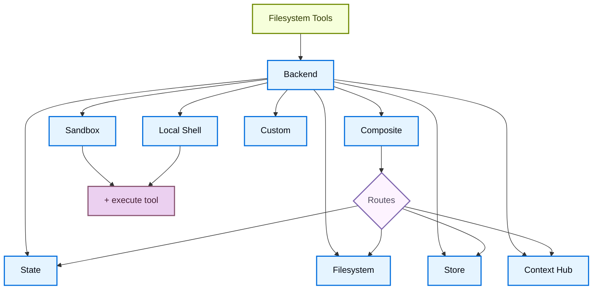

import BackendStatePy from '/snippets/code-samples/backend-state-py.mdx';
import BackendStateJs from '/snippets/code-samples/backend-state-js.mdx';
import BackendFilesystemPy from '/snippets/code-samples/backend-filesystem-py.mdx';
import BackendFilesystemJs from '/snippets/code-samples/backend-filesystem-js.mdx';
import BackendLocalShellPy from '/snippets/code-samples/backend-local-shell-py.mdx';
import BackendLocalShellJs from '/snippets/code-samples/backend-local-shell-js.mdx';
import BackendStorePy from '/snippets/code-samples/backend-store-py.mdx';
import BackendStoreJs from '/snippets/code-samples/backend-store-js.mdx';
import BackendContextHubPy from '/snippets/code-samples/backend-context-hub-py.mdx';
import BackendCompositePy from '/snippets/code-samples/backend-composite-py.mdx';
import BackendCompositeJs from '/snippets/code-samples/backend-composite-js.mdx';

Deep Agents 通过 `ls`、`read_file`、`write_file`、`edit_file`、`glob` 和 `grep` 等 tools 向 agent 暴露 filesystem surface。这些 tools 通过可插拔 backend 运行。`read_file` tool 在所有 backends 中原生支持 image files（`.png`、`.jpg`、`.jpeg`、`.gif`、`.webp`），并以 multimodal content blocks 返回它们。


Sandboxes 和 [`LocalShellBackend`](https://reference.langchain.com/python/deepagents/backends/local_shell/LocalShellBackend) 也会提供 `execute` tool。
本页说明如何：

- [choose a backend](#specify-a-backend)
- [route different paths to different backends](#route-to-different-backends)
- [implement your own virtual filesystem](#use-a-virtual-filesystem)（例如 S3 或 Postgres）
- [set permissions](#permissions) 控制 filesystem access

- [comply with the backend protocol](#protocol-reference)


## 快速开始 {#quickstart}

下面是一些可以快速用于 deep agent 的预构建 filesystem backends：

| 内置 backend | 说明 |
|---|---|
| [Default](#statebackend) | `agent = create_deep_agent(model="google_genai:gemini-3.5-flash")` <br></br> Thread-scoped。agent 的默认 filesystem backend 存储在 `langgraph` state 中。Files 会通过你的 checkpointer 在同一个 thread 的多个 turns 之间持久存在，但不会在 threads 之间共享。 |
| [Local filesystem persistence](#filesystembackend-local-disk) | `agent = create_deep_agent(model="google_genai:gemini-3.5-flash", backend=FilesystemBackend(root_dir="/Users/nh/Desktop/"))` <br></br>这会让 deep agent 访问你本机的 filesystem。你可以指定 agent 有权访问的 root directory。注意，提供的任何 `root_dir` 都必须是 absolute path。通常应包在 [CompositeBackend](#compositebackend-router) 中，让内部 agent data（offloaded tool results、conversation history）和你的 project files 分离。 |
| [Durable store (LangGraph store)](#storebackend-langgraph-store) | `agent = create_deep_agent(model="google_genai:gemini-3.5-flash", backend=StoreBackend())` <br></br>这会让 agent 访问会_跨 threads 持久存在_的 long-term storage。它很适合保存 longer term memories，或多次执行中都适用于 agent 的 instructions。 |
| [Context Hub](#contexthubbackend) | `agent = create_deep_agent(model="google_genai:gemini-3.5-flash", backend=ContextHubBackend("my-agent"))` <br></br>把 files 持久存储在 LangSmith Hub repo 中，无需额外配置 LangGraph store。 |
| [Sandbox](/oss/python/deepagents/sandboxes) | `agent = create_deep_agent(model="google_genai:gemini-3.5-flash", backend=sandbox)` <br></br>在隔离环境中执行代码。Sandboxes 提供 filesystem tools，并额外提供用于运行 shell commands 的 `execute` tool。可选择 Modal、Daytona、Deno 或 local VFS。 |
| [Local shell](#localshellbackend-local-shell) | `agent = create_deep_agent(model="google_genai:gemini-3.5-flash", backend=LocalShellBackend(root_dir=".", env={"PATH": "/usr/bin:/bin"}))` <br></br>直接在 host 上进行 filesystem 和 shell execution。没有隔离，只能在受控开发环境中使用。请参阅下方 [security considerations](#localshellbackend-local-shell)。 |
| [Composite](#compositebackend-router) | 默认 thread-scoped，`/memories/` 跨 threads 持久化。Composite backend 最灵活。你可以指定 filesystem 中的不同 routes 指向不同 backends。下面的 Composite routing 部分提供了可直接粘贴的示例。 |



## 内置 backends {#built-in-backends}

### StateBackend

<BackendStatePy />


**How it works:**
- 通过 [`StateBackend`](https://reference.langchain.com/python/deepagents/backends/state/StateBackend) 把 files 存储在当前 thread 的 LangGraph agent state 中。
- 通过 checkpoints 在同一个 thread 的多个 agent turns 之间持久存在。Files 不会跨 threads 共享。

<Warning>
该 backend 设计为在 graph 内部使用。在 graph run 外部调用 backend methods（例如 `state_backend.upload_files(...)`）不会立即生效，要等 graph 执行时才会生效。
</Warning>

**Best for:**
- 让 agent 写入 intermediate results 的 scratch pad。
- 自动驱逐大型 tool outputs，之后 agent 可以分片读回。

注意，这个 backend 会由 supervisor agent 和 subagents 共享；subagent 写入的任何 files 都会保留在 LangGraph agent state 中，
即使该 subagent 的执行已经完成。这些 files 会继续对 supervisor agent 和其他 subagents 可用。

### FilesystemBackend（本地磁盘） {#filesystembackend-local-disk}

[`FilesystemBackend`](https://reference.langchain.com/python/deepagents/backends/filesystem/FilesystemBackend) 会在可配置 root directory 下读取和写入真实 files。

<Warning>
该 backend 会授予 agents 直接 filesystem read/write access。
请谨慎使用，并且只在合适环境中使用。

**Appropriate use cases:**
- 本地开发 CLIs（coding assistants、development tools）
- CI/CD pipelines（参见下方 security considerations）

**Inappropriate use cases:**
- Web servers 或 HTTP APIs：请改用 `StateBackend`、`StoreBackend` 或 [sandbox backend](/oss/python/deepagents/sandboxes)

**Security risks:**
- Agents 可以读取任何可访问文件，包括 secrets（API keys、credentials、`.env` files）
- 如果再结合 network tools，secrets 可能通过 SSRF attacks 外传
- File modifications 是永久且不可逆的

**Recommended safeguards:**
1. 启用 [Human-in-the-Loop (HITL) middleware](/oss/python/deepagents/human-in-the-loop)，以 review 敏感操作。
1. 从可访问 filesystem paths 中排除 secrets（尤其是在 CI/CD 中）。
1. 对需要 filesystem interaction 的 production environments 使用 [sandbox backend](/oss/python/deepagents/sandboxes)。
1. 与 `root_dir` 一起**始终**使用 `virtual_mode=True`，启用基于 path 的访问限制（阻止 `..`、`~` 以及 root 外的 absolute paths）。
   注意默认值（`virtual_mode=False`）即使设置了 `root_dir` 也不提供安全性。
</Warning>

<BackendFilesystemPy />


**How it works:**
- 在可配置的 `root_dir` 下读取/写入真实 files。
- 你可以选择设置 `virtual_mode=True`，把 paths sandbox 并 normalize 到 `root_dir` 下。
- 使用安全 path resolution，尽可能防止不安全的 symlink traversal，并可使用 ripgrep 进行快速 `grep`。

**Best for:**
- 你机器上的本地 projects
- CI sandboxes
- Mounted persistent volumes

<Tip>
大多数场景下，**把 `FilesystemBackend` 包在 `CompositeBackend` 中**。Deep Agents 会自动把内部数据写入 backend，包括 offloaded large tool results（位于 `/large_tool_results/` 下）和 conversation history（位于 `/conversation_history/` 下）。如果单独使用 `FilesystemBackend`，这些内部 files 会被写到 `root_dir` 下的真实磁盘中，与 project files 混在一起。

使用 `CompositeBackend` 可以把 project directory 路由到 `FilesystemBackend`，同时让内部 paths 保留在 ephemeral `StateBackend` storage 中：

```python
from deepagents import create_deep_agent
from deepagents.backends import CompositeBackend, StateBackend, FilesystemBackend

agent = create_deep_agent(
    backend=CompositeBackend(
        default=StateBackend(),
        routes={
            "/workspace/": FilesystemBackend(root_dir="/path/to/project", virtual_mode=True),
        },
    )
)
```


这样，agent 在 `/workspace/` 下的读写会进入真实磁盘，而 offloaded tool results 和其他内部数据会留在 ephemeral state 中。更多 routing patterns 请参阅 [Route to different backends](#route-to-different-backends)。
</Tip>

### LocalShellBackend（本地 shell） {#localshellbackend-local-shell}

<Warning>
该 backend 会授予 agents 直接 filesystem read/write access，**并且**允许在你的 host 上不受限制地执行 shell。
请极其谨慎地使用，并且只在合适环境中使用。

**Appropriate use cases:**
- 本地开发 CLIs（coding assistants、development tools）
- 你信任 agent code 的个人开发环境
- 配有适当 secret management 的 CI/CD pipelines

**Inappropriate use cases:**
- Production environments（例如 web servers、APIs、multi-tenant systems）
- 处理 untrusted user input 或执行 untrusted code

**Security risks:**
- Agents 可以用你的用户权限执行**任意 shell commands**
- Agents 可以读取任何可访问文件，包括 secrets（API keys、credentials、`.env` files）
- Secrets 可能被暴露
- File modifications 和 command execution 是**永久且不可逆的**
- Commands 直接在你的 host system 上运行
- Commands 可以消耗不受限制的 CPU、memory、disk

**Recommended safeguards:**
1. 启用 [Human-in-the-Loop (HITL) middleware](/oss/python/deepagents/human-in-the-loop)，在执行前 review 并 approve operations。**强烈推荐**这样做。
2. 只在专用开发环境中运行。绝不要在 shared 或 production systems 上使用。
3. 对需要 shell execution 的 production environments 使用 [sandbox backend](/oss/python/deepagents/sandboxes)。

**Note:** 启用 shell access 后，`virtual_mode=True` 不提供安全性，因为 commands 可以访问系统上的任何 path。
</Warning>

<BackendLocalShellPy />


**How it works:**
- 扩展 `FilesystemBackend`，增加用于在 host 上运行 shell commands 的 `execute` tool。
- Commands 直接在你的机器上通过 `subprocess.run(shell=True)` 运行，没有 sandboxing。
- 支持 `timeout`（默认 120s）、`max_output_bytes`（默认 100,000）、`env` 和 `inherit_env` 来配置 environment variables。
- Shell commands 使用 `root_dir` 作为 working directory，但可以访问系统上的任何 path。

**Best for:**
- 本地 coding assistants 和 development tools
- 当你信任 agent 时，在开发期间快速迭代

### StoreBackend（LangGraph store） {#storebackend-langgraph-store}

<BackendStorePy />


<Note>
    部署到 [LangSmith Deployment](/langsmith/deployment) 时，请省略 `store` 参数。平台会自动为你的 agent provision store。
</Note>

<Tip>
    `namespace` 参数控制数据隔离。对于 multi-user deployments，请始终设置 [namespace factory](/oss/python/deepagents/backends#namespace-factories)，以按 user 或 tenant 隔离数据。
</Tip>

**How it works:**
- [`StoreBackend`](https://reference.langchain.com/python/deepagents/backends/store/StoreBackend) 会把 files 存储到 runtime 提供的 LangGraph [`BaseStore`](https://reference.langchain.com/python/langchain-core/stores/BaseStore) 中，从而支持 cross-thread durable storage。

**Best for:**
- 当你已经运行在配置好的 LangGraph store 上时（例如 Redis、Postgres，或 [`BaseStore`](https://reference.langchain.com/python/langchain-core/stores/BaseStore) 背后的 cloud implementations）。
- 当你通过 [LangSmith Deployment](/langsmith/deployment) 部署 agent 时（平台会自动为 agent provision store）。

#### 命名空间工厂 {#namespace-factories}

namespace factory 控制 `StoreBackend` 从哪里读取和向哪里写入数据。它接收 LangGraph [`Runtime`](https://reference.langchain.com/python/langgraph/runtime/Runtime)，并返回一个字符串 tuple 作为 store namespace。使用 namespace factories 可以在 users、tenants 或 assistants 之间隔离数据。

构造 `StoreBackend` 时，把 namespace factory 传给 `namespace` 参数：

```python
NamespaceFactory = Callable[[Runtime], tuple[str, ...]]
```

`Runtime` 提供：
- `rt.context` - 通过 LangGraph [context schema](https://langchain-ai.github.io/langgraph/concepts/runtime/) 传入的 user-supplied context（例如 `user_id`）
- `rt.server_info` - 在 LangGraph Server 上运行时的 server-specific metadata（assistant ID、graph ID、authenticated user）
- `rt.execution_info` - Execution identity information（thread ID、run ID、checkpoint ID）


<Note>
`Runtime` argument 在 `deepagents>=0.5.2` 中可用。更早的 0.5.x releases 会传入 `BackendContext`，请参阅下方 [migrating from `BackendContext`](#migrating-from-backendcontext)。`rt.server_info` 和 `rt.execution_info` 需要 `deepagents>=0.5.0`。
</Note>


**Common namespace patterns:**

```python
from deepagents.backends import StoreBackend

# Per-user: each user gets their own isolated storage
backend = StoreBackend(
    namespace=lambda rt: (rt.server_info.user.identity,),  # [!code highlight]
)

# Per-assistant: all users of the same assistant share storage
backend = StoreBackend(
    namespace=lambda rt: (
        rt.server_info.assistant_id,  # [!code highlight]
    ),
)

# Per-thread: storage scoped to a single conversation
backend = StoreBackend(
    namespace=lambda rt: (
        rt.execution_info.thread_id,  # [!code highlight]
    ),
)
```


你可以组合多个 components 来创建更具体的 scope，例如用 `(user_id, thread_id)` 做 per-user per-conversation isolation，或追加 `"filesystem"` 这样的 suffix，以便在同一个 scope 使用多个 store namespaces 时消除歧义。

Namespace components 只能包含 alphanumeric characters、hyphens、underscores、dots、`@`、`+`、colons 和 tildes。Wildcards（`*`、`?`）会被拒绝，以防止 glob injection。

<Warning>
    `namespace` 参数将在 v0.5.0 中成为**必填项**。新代码请始终显式设置。
</Warning>


<Note>
    如果未提供 namespace factory，legacy default 会使用 LangGraph config metadata 中的 `assistant_id`。这意味着同一个 [assistant](/langsmith/assistants) 的所有 users 都会共享同一份 storage。对于 multi-user [going to production](/oss/python/deepagents/going-to-production)，请始终提供 namespace factory。
</Note>

### ContextHubBackend

<BackendContextHubPy />


`ContextHubBackend` 会把 files 存储在 LangSmith Hub repo 中。使用 `owner/name` 或 `name` 格式的 repo identifier 构造它。

<Note>
使用 `ContextHubBackend` 前请设置 `LANGSMITH_API_KEY`。
</Note>

**How it works:**
- 第一次使用时 lazy pull Hub repo tree，之后从 in-memory cache 提供 reads。
- 把 writes 和 edits 持久化为 Hub commits，并在成功 commit 后更新 cache。
- 使用 optimistic parent-commit writes（`parent_commit`）：每次 push 都以最新已知 commit hash 为目标。

**Behavior and limits:**
- 如果 repo 不存在，第一次 pull 会被视为空；第一次成功 write 可以创建该 repo。
- 如果另一个 writer 先推进了 repo，你的 stale parent-commit write 可能失败。遇到 conflict 时请 re-pull 并 retry。
- `upload_files()` 接受 UTF-8 text。非 UTF-8 files 会按 path 以 `invalid_path` 拒绝。

**Best for:**
- LangSmith-native durable filesystem persistence，无需单独接入 LangGraph `BaseStore`。
- 受益于 filesystem changes 的 Hub commit history 的 workflows。

### CompositeBackend（router） {#compositebackend-router}

<BackendCompositePy />


**How it works:**
- [`CompositeBackend`](https://reference.langchain.com/python/deepagents/backends/composite/CompositeBackend) 会根据 path prefix 把 file operations 路由到不同 backends。
- 在 listings 和 search results 中保留原始 path prefixes。

**Best for:**
- 当你希望给 agent 同时提供 thread-scoped 和 cross-thread storage 时，`CompositeBackend` 允许你同时提供 `StateBackend` 和 `StoreBackend`。
- 当你有多个信息来源，希望把它们作为单个 filesystem 的一部分提供给 agent 时。
    - 例如，你把 long-term memories 存在某个 Store 的 `/memories/` 下，同时还有一个 custom backend 在 `/docs/` 下提供 documentation。

## 指定 backend {#specify-a-backend}

- 向 `create_deep_agent(model=..., backend=...)` 传入 backend instance。filesystem middleware 会把它用于所有 tooling。
- backend 必须实现 `BackendProtocol`（例如 `StateBackend()`、`FilesystemBackend(root_dir=".")`、`StoreBackend()`、`ContextHubBackend("my-agent")`）。
- 如果省略，默认是 `StateBackend()`。


## 路由到不同 backends {#route-to-different-backends}

把 namespace 的不同部分路由到不同 backends。常见用途是让 `/memories/*` 跨 threads 持久存在，同时让其他内容保持 thread-scoped。

```python
from deepagents import create_deep_agent
from deepagents.backends import CompositeBackend, StateBackend, FilesystemBackend

agent = create_deep_agent(
    model="google_genai:gemini-3.5-flash",
    backend=CompositeBackend(
        default=StateBackend(),
        routes={
            "/memories/": FilesystemBackend(root_dir="/deepagents/myagent", virtual_mode=True),
        },
    )
)
```


Behavior:
- `/workspace/plan.md` -> `StateBackend`（thread-scoped）
- `/memories/agent.md` -> `/deepagents/myagent` 下的 `FilesystemBackend`
- `ls`、`glob`、`grep` 会聚合结果，并显示原始 path prefixes。

Notes:
- 更长的 prefixes 优先（例如 route `"/memories/projects/"` 可以覆盖 `"/memories/"`）。
- 使用 StoreBackend routing 时，请确保通过 `create_deep_agent(model=..., store=...)` 提供了 store，或由平台 provision。
- Deep Agents 会把内部数据（offloaded tool results、conversation history）写入 default backend。使用 `StateBackend` 作为 default，可以让这些 artifacts 保持 ephemeral，并避免写到磁盘或 persistent store。完整示例请参阅 [FilesystemBackend tip](#filesystembackend-local-disk)。

## 使用 virtual filesystem {#use-a-virtual-filesystem}

构建 custom backend，把远程或数据库 filesystem（例如 S3 或 Postgres）投射到 tools namespace 中。

Design guidelines:

- Paths 是 absolute（`/x/y.txt`）。请决定如何把它们映射到你的 storage keys/rows。
- 高效实现 `ls` 和 `glob`（可用时做 server-side filtering，否则做 local filter）。
- 对于 external persistence（S3、Postgres 等），在 write/edit results 中返回 `files_update=None`（Python）或省略 `filesUpdate`（JS）；只有 in-memory state backends 需要返回 files update dict。

- 使用 `ls` 和 `glob` 作为方法名。
- 对于 missing files 或 invalid patterns，请返回带 `error` field 的 structured result types（不要 raise）。


S3-style outline:

```python
from deepagents.backends.protocol import (
    BackendProtocol, WriteResult, EditResult, LsResult, ReadResult, GrepResult, GlobResult,
)

class S3Backend(BackendProtocol):
    def __init__(self, bucket: str, prefix: str = ""):
        self.bucket = bucket
        self.prefix = prefix.rstrip("/")

    def _key(self, path: str) -> str:
        return f"{self.prefix}{path}"

    def ls(self, path: str) -> LsResult:
        # List objects under _key(path); build FileInfo entries (path, size, modified_at)
        ...

    def read(self, file_path: str, offset: int = 0, limit: int = 2000) -> ReadResult:
        # Fetch object; return ReadResult(file_data=...) or ReadResult(error=...)
        ...

    def grep(self, pattern: str, path: str | None = None, glob: str | None = None) -> GrepResult:
        # Optionally filter server-side; else list and scan content
        ...

    def glob(self, pattern: str, path: str = "/") -> GlobResult:
        # Apply glob relative to path across keys
        ...

    def write(self, file_path: str, content: str) -> WriteResult:
        # Enforce create-only semantics; return WriteResult(path=file_path, files_update=None)
        ...

    def edit(self, file_path: str, old_string: str, new_string: str, replace_all: bool = False) -> EditResult:
        # Read -> replace (respect uniqueness vs replace_all) -> write -> return occurrences
        ...
```


Postgres-style outline:

- Table `files(path text primary key, content text, created_at timestamptz, modified_at timestamptz)`
- 把 tool operations 映射到 SQL：
  - `ls` 使用 `WHERE path LIKE $1 || '%'`
  - `glob` 在 SQL 中 filter，或 fetch 后在 Python 中 apply glob
  - `grep` 可以按 extension 或 last modified time fetch candidate rows，然后 scan lines


## 权限 {#permissions}

使用 [permissions](/oss/python/deepagents/permissions) 声明式控制 agent 可以 read 或 write 哪些 files 和 directories。Permissions 适用于内置 filesystem tools，并在调用 backend 之前进行评估。

```python
from deepagents import create_deep_agent, FilesystemPermission

agent = create_deep_agent(
    model="google_genai:gemini-3.5-flash",
    backend=CompositeBackend(
        default=StateBackend(),
        routes={
            "/memories/": StoreBackend(
                namespace=lambda rt: (rt.server_info.user.identity,),
            ),
            "/policies/": StoreBackend(
                namespace=lambda rt: (rt.context.org_id,),
            ),
        },
    ),
    permissions=[
        FilesystemPermission(
            operations=["write"],
            paths=["/policies/**"],
            mode="deny",
        ),
    ],
)
```


完整选项，包括 rule ordering、subagent permissions 和 composite backend interactions，请参阅 [permissions guide](/oss/python/deepagents/permissions)。

## 添加 policy hooks {#add-policy-hooks}

如果需要超出 path-based allow/deny rules 的自定义 validation logic（rate limiting、audit logging、content inspection），可以通过 subclassing 或 wrapping backend 来执行 enterprise rules。

阻止在选定 prefixes 下 writes/edits（subclass）：

```python
from deepagents.backends.filesystem import FilesystemBackend
from deepagents.backends.protocol import WriteResult, EditResult

class GuardedBackend(FilesystemBackend):
    def __init__(self, *, deny_prefixes: list[str], **kwargs):
        super().__init__(**kwargs)
        self.deny_prefixes = [p if p.endswith("/") else p + "/" for p in deny_prefixes]

    def write(self, file_path: str, content: str) -> WriteResult:
        if any(file_path.startswith(p) for p in self.deny_prefixes):
            return WriteResult(error=f"Writes are not allowed under {file_path}")
        return super().write(file_path, content)

    def edit(self, file_path: str, old_string: str, new_string: str, replace_all: bool = False) -> EditResult:
        if any(file_path.startswith(p) for p in self.deny_prefixes):
            return EditResult(error=f"Edits are not allowed under {file_path}")
        return super().edit(file_path, old_string, new_string, replace_all)
```


Generic wrapper（适用于任何 backend）：

```python
from deepagents.backends.protocol import (
    BackendProtocol, WriteResult, EditResult, LsResult, ReadResult, GrepResult, GlobResult,
)

class PolicyWrapper(BackendProtocol):
    def __init__(self, inner: BackendProtocol, deny_prefixes: list[str] | None = None):
        self.inner = inner
        self.deny_prefixes = [p if p.endswith("/") else p + "/" for p in (deny_prefixes or [])]

    def _deny(self, path: str) -> bool:
        return any(path.startswith(p) for p in self.deny_prefixes)

    def ls(self, path: str) -> LsResult:
        return self.inner.ls(path)

    def read(self, file_path: str, offset: int = 0, limit: int = 2000) -> ReadResult:
        return self.inner.read(file_path, offset=offset, limit=limit)
    def grep(self, pattern: str, path: str | None = None, glob: str | None = None) -> GrepResult:
        return self.inner.grep(pattern, path, glob)
    def glob(self, pattern: str, path: str = "/") -> GlobResult:
        return self.inner.glob(pattern, path)
    def write(self, file_path: str, content: str) -> WriteResult:
        if self._deny(file_path):
            return WriteResult(error=f"Writes are not allowed under {file_path}")
        return self.inner.write(file_path, content)
    def edit(self, file_path: str, old_string: str, new_string: str, replace_all: bool = False) -> EditResult:
        if self._deny(file_path):
            return EditResult(error=f"Edits are not allowed under {file_path}")
        return self.inner.edit(file_path, old_string, new_string, replace_all)
```


## 从 backend factories 迁移 {#migrate-from-backend-factories}

<Warning>
backend factory pattern 从 `deepagents` 0.5.0 起已**弃用**。请直接传入预先构造好的 backend instances，而不是 factory functions。


</Warning>

以前，`StateBackend` 和 `StoreBackend` 等 backends 需要一个接收 runtime object 的 factory function，因为它们需要 runtime context（state、store）才能运行。现在 backends 会通过 LangGraph 的 `get_config()`、`get_store()` 和 `get_runtime()` helpers 在内部解析这些 context，因此你可以直接传入 instances。

### 变更内容 {#what-changed}

| 之前（已弃用） | 之后 |
|---|---|
| `backend=lambda rt: StateBackend(rt)` | `backend=StateBackend()` |
| `backend=lambda rt: StoreBackend(rt)` | `backend=StoreBackend()` |
| `backend=lambda rt: CompositeBackend(default=StateBackend(rt), ...)` | `backend=CompositeBackend(default=StateBackend(), ...)` |
| `backend: (config) => new StateBackend(config)` | `backend: new StateBackend()` |
| `backend: (config) => new StoreBackend(config)` | `backend: new StoreBackend()` |

### 已弃用 API {#deprecated-apis}

| 已弃用 | 替代方式 |
|---|---|
| 在 `create_deep_agent` 中向 `backend=` 传入 callable | 直接传入 backend instance |
| `StateBackend(runtime)` 上的 `runtime` constructor argument | `StateBackend()`（无需 arguments） |
| `StoreBackend(runtime)` 上的 `runtime` constructor argument | `StoreBackend()` 或 `StoreBackend(namespace=..., store=...)` |
| `WriteResult` 和 `EditResult` 上的 `files_update` field | State writes 现在由 backend 内部处理 |
| middleware write/edit tools 中的 `Command` wrapping | Tools 返回 plain strings；不再需要 `Command(update=...)` |


<Note>
factory pattern 在运行时仍然可用，并会发出 deprecation warning。请在下一个 major version 前把代码更新为使用 direct instances。
</Note>

### 迁移示例 {#migration-example}

```python
# Before (deprecated)
from deepagents import create_deep_agent
from deepagents.backends import CompositeBackend, StateBackend, StoreBackend

agent = create_deep_agent(
    model="google_genai:gemini-3.5-flash",
    backend=lambda rt: CompositeBackend(
        default=StateBackend(rt),
        routes={"/memories/": StoreBackend(rt, namespace=lambda rt: (rt.server_info.user.identity,))},
    ),
)

# After
agent = create_deep_agent(
    model="google_genai:gemini-3.5-flash",
    backend=CompositeBackend(
        default=StateBackend(),
        routes={"/memories/": StoreBackend(namespace=lambda rt: (rt.server_info.user.identity,))},
    ),
)
```


### 从 `BackendContext` 迁移 {#migrating-from-backendcontext}

在 `deepagents>=0.5.2`（Python）和 `deepagents>=1.9.1`（TypeScript）中，namespace factories 会直接接收 LangGraph [`Runtime`](https://reference.langchain.com/python/langgraph/runtime/Runtime)，而不是 `BackendContext` wrapper。旧的 `BackendContext` 形式仍可通过 backwards-compatible `.runtime` 和 `.state` accessors 使用，但这些 accessors 会发出 deprecation warning，并将在 `deepagents>=0.7` 中移除。

**What changed:**

- factory argument 现在是 `Runtime`，不是 `BackendContext`。
- 删除 `.runtime` accessor，例如 `ctx.runtime.context.user_id` 变为 `rt.server_info.user.identity`。
- `ctx.state` 没有直接替代项。Namespace info 应该是 read-only，并在一次 run 的生命周期内保持稳定；而 state 是 mutable，会逐 step 改变，从它派生 namespace 可能导致数据落入不一致的 keys 下。如果你的 use case 需要读取 agent state，请 [open an issue](https://github.com/langchain-ai/deepagents/issues)。

```python
# Before (deprecated, removed in v0.7)
StoreBackend(
    namespace=lambda ctx: (ctx.runtime.context.user_id,),  # [!code --]
)

# After
StoreBackend(
    namespace=lambda rt: (rt.server_info.user.identity,),  # [!code ++]
)
```


## 协议参考 {#protocol-reference}

Backends 必须实现 [`BackendProtocol`](https://reference.langchain.com/python/deepagents/backends/protocol/BackendProtocol)。

Required methods:
- `ls(path: str) -> LsResult`
  - 返回至少包含 `path` 的 entries。可用时包含 `is_dir`、`size`、`modified_at`。按 `path` 排序以获得 deterministic output。
- `read(file_path: str, offset: int = 0, limit: int = 2000) -> ReadResult`
  - 成功时返回 file data。文件缺失时返回 `ReadResult(error="Error: File '/x' not found")`。
- `grep(pattern: str, path: Optional[str] = None, glob: Optional[str] = None) -> GrepResult`
  - 返回 structured matches。出错时返回 `GrepResult(error="...")`（不要 raise）。
- `glob(pattern: str, path: str = "/") -> GlobResult`
  - 以 `FileInfo` entries 返回匹配 files（没有匹配时为空列表）。
- `write(file_path: str, content: str) -> WriteResult`
  - Create-only。冲突时返回 `WriteResult(error=...)`。成功时设置 `path`；对于 state backends 设置 `files_update={...}`，external backends 应使用 `files_update=None`。
- `edit(file_path: str, old_string: str, new_string: str, replace_all: bool = False) -> EditResult`
  - 除非 `replace_all=True`，否则强制 `old_string` 唯一。如果找不到则返回 error。成功时包含 `occurrences`。

Supporting types:
- `LsResult(error, entries)` - 成功时 `entries` 是 `list[FileInfo]`，失败时为 `None`。
- `ReadResult(error, file_data)` - 成功时 `file_data` 是 `FileData` dict，失败时为 `None`。
- `GrepResult(error, matches)` - 成功时 `matches` 是 `list[GrepMatch]`，失败时为 `None`。
- `GlobResult(error, matches)` - 成功时 `matches` 是 `list[FileInfo]`，失败时为 `None`。
- `WriteResult(error, path, files_update)`
- `EditResult(error, path, files_update, occurrences)`
- `FileInfo` fields：`path`（必填），可选 `is_dir`、`size`、`modified_at`。
- `GrepMatch` fields：`path`、`line`、`text`。
- `FileData` fields：`content`（str）、`encoding`（`"utf-8"` 或 `"base64"`）、`created_at`、`modified_at`。
:::

---

<div className="source-links">
<Callout icon="terminal-2">
    [Connect these docs](/use-these-docs) to Claude, VSCode, and more via MCP for real-time answers.
</Callout>
<Callout icon="edit">
    [Edit this page on GitHub](https://github.com/langchain-ai/docs/edit/main/src/oss/deepagents/backends.mdx) or [file an issue](https://github.com/langchain-ai/docs/issues/new/choose).
</Callout>
</div>
