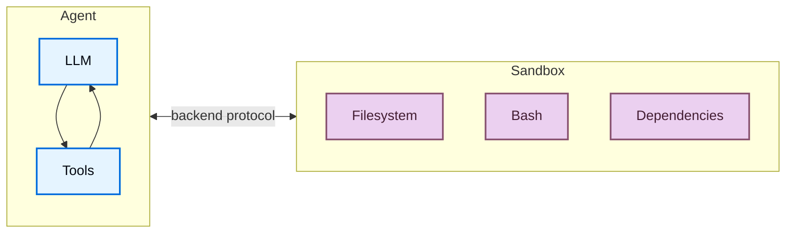
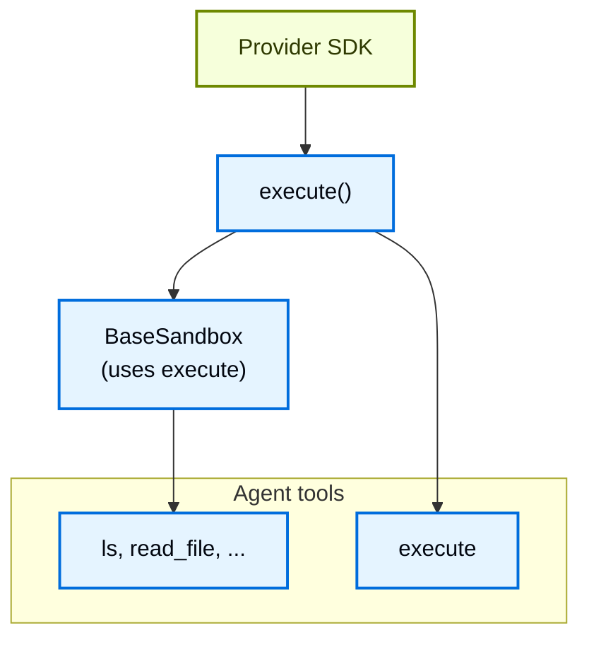
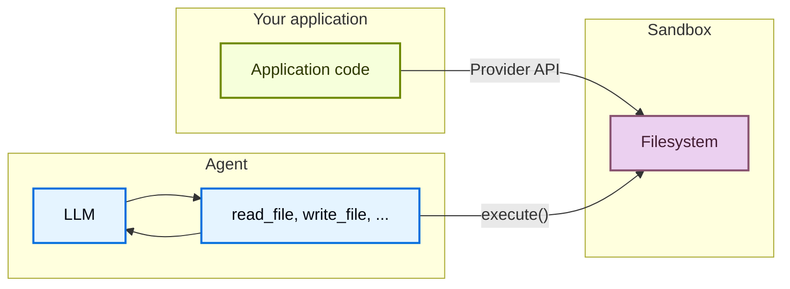

import SandboxBasicJs from '/snippets/deepagents-sandbox-basic-js.mdx';
import SandboxBasicPy from '/snippets/deepagents-sandbox-basic-py.mdx';
import SandboxLifecycleFactoryAssistantPy from '/snippets/deepagents-sandbox-lifecycle-factory-assistant-py.mdx';
import SandboxLifecycleFactoryAssistantTs from '/snippets/deepagents-sandbox-lifecycle-factory-assistant-ts.mdx';
import SandboxLifecycleFactoryThreadPy from '/snippets/deepagents-sandbox-lifecycle-factory-thread-py.mdx';
import SandboxLifecycleFactoryThreadTs from '/snippets/deepagents-sandbox-lifecycle-factory-thread-ts.mdx';

Agents 会生成代码、与 filesystems 交互，并运行 shell commands。因为我们无法预先知道 agent 可能会做什么，所以必须把它的环境隔离起来，避免它访问 credentials、files 或 network。Sandboxes 会在 agent 的执行环境和你的 host system 之间创建边界，从而提供这种隔离。

在 Deep Agents 中，**sandboxes 是 [backends](/oss/python/deepagents/backends)**，用于定义 agent 运行的环境。不同于其他只暴露文件操作的 backends（State、Filesystem、Store），sandbox backends 还会给 agent 一个 `execute` tool，用来运行 shell commands。配置 sandbox backend 后，agent 会获得：

- 所有标准 filesystem tools（`ls`、`read_file`、`write_file`、`edit_file`、`glob`、`grep`）
- 用于在 sandbox 中运行任意 shell commands 的 `execute` tool
- 保护 host system 的安全边界



## 为什么使用 sandboxes？ {#why-use-sandboxes}

Sandboxes 用于安全隔离。
它们允许 agents 执行任意代码、访问文件、使用 network，同时不会危及你的 credentials、本地 files 或 host system。
当 agents 自主运行时，这种隔离尤其重要。

Sandboxes 特别适合：

- Coding agents：自主运行的 agents 可以使用 shell、git、clone repositories（许多 providers 提供原生 git APIs，例如 [Daytona 的 git operations](https://www.daytona.io/docs/en/git-operations/)），并运行 Docker-in-Docker 来完成 build 和 test pipelines
- Data analysis agents：在安全隔离环境中加载文件、安装数据分析库（pandas、numpy 等）、运行统计计算，并创建 PowerPoint presentations 等输出

<Tip>
    **使用 Deep Agents Code？** Deep Agents Code 通过 `--sandbox` flag 内置支持 sandbox。Deep Agents Code 专用的 setup、flags（`--sandbox-id`、`--sandbox-setup`）和示例，请参阅 [Use remote sandboxes](/oss/python/deepagents/code/remote-sandboxes)。
</Tip>

## 基本用法 {#basic-usage}

这些示例假设你已经使用 provider 的 SDK 创建了 sandbox/devbox，并配置好了 credentials。注册、认证和 provider-specific lifecycle 细节，请参阅 [Available providers](#available-providers)。


<SandboxBasicPy />


## 可用 providers {#available-providers}

provider-specific setup、authentication 和 lifecycle 细节请参阅 [sandbox integrations](/oss/python/integrations/sandboxes)。


没有看到你的 provider？你可以实现自己的 sandbox backend。请参阅 [Contributing a sandbox integration](/oss/python/contributing/integrations-langchain)。

## 生命周期和作用域 {#lifecycle-and-scoping}

大多数应用会选择每个 [thread](/langsmith/use-threads) 一个 sandbox（thread-scoped），或者同一 [assistant](/langsmith/assistants) 上所有 threads 共用一个 sandbox（assistant-scoped）。

Sandboxes 在关闭前会持续消耗资源并产生费用。请确保在不再使用时关闭 sandboxes。

完整 lifecycle table、async [graph factory](/langsmith/graph-rebuild) 注意事项、TTL 行为、LangGraph Deployment wiring 和 client-side 示例，请参阅 Going to production 中的 [Sandbox lifecycle](/oss/python/deepagents/going-to-production#lifecycle)。

### Thread 作用域（默认） {#thread-scoped-default}

每个 conversation 都获得自己的 sandbox。第一次运行会创建它；同一个 thread 上的后续 turns 会复用它。当 thread 结束或 sandbox TTL 过期时，该环境会消失。请像下面示例那样，用 provider labels 或 metadata 存储映射，使每次运行都能解析到同一个 sandbox。

<Tip>
当 users 可能在空闲后返回时，请在 sandbox 上配置 TTL，让 provider 自动删除或归档闲置环境。
</Tip>

<Tabs>
    <Tab title="Python">

<SandboxLifecycleFactoryThreadPy />

    </Tab>
    <Tab title="TypeScript">

<SandboxLifecycleFactoryThreadTs />

    </Tab>
</Tabs>

### Assistant 作用域 {#assistant-scoped}

同一 assistant 上的每个 thread 都会复用同一个 sandbox。Files、已安装 packages 和 cloned repositories 会跨 conversations 保留。

<Warning>
Assistant-scoped sandboxes 会随着时间积累 in-sandbox state。请用你的 sandbox provider 配置 TTL、使用 snapshots 定期重置，或实现 cleanup logic，避免 disk 和 memory 无限制增长。
</Warning>

<Tabs>
    <Tab title="Python">

<SandboxLifecycleFactoryAssistantPy />

    </Tab>
    <Tab title="TypeScript">

<SandboxLifecycleFactoryAssistantTs />

    </Tab>
</Tabs>

如果需要在 graph factory 外部手动 create、execute 和 teardown，请参阅 [Basic usage](#basic-usage) 以及 provider-specific APIs 的 [sandbox integrations](/oss/python/integrations/sandboxes)。

## 集成模式 {#integration-patterns}

根据 agent 在哪里运行，agents 与 sandboxes 集成有两种架构模式。

### Agent-in-sandbox 模式 {#agent-in-sandbox-pattern}

agent 在 sandbox 内运行，你通过 network 与它通信。你需要构建一个预装 agent framework 的 Docker 或 VM image，在 sandbox 内运行它，然后从外部连接并发送 messages。

优点：

- ✓ 更接近本地开发环境。
- ✓ agent 与执行环境耦合紧密。

取舍：

- ⚠ API keys 必须放在 sandbox 内（安全风险）。
- ⚠ 更新需要重新构建 images。
- ⚠ 需要通信基础设施（WebSocket 或 HTTP layer）。

要在 sandbox 中运行 agent，请构建一个 image 并安装 deepagents。

```dockerfile
FROM python:3.11
RUN pip install deepagents-code
```

然后在 sandbox 内运行 agent。
要使用 sandbox 内的 agent，你必须添加额外基础设施，处理你的应用与 sandbox 内 agent 之间的通信。

### Sandbox-as-tool 模式 {#sandbox-as-tool-pattern}

agent 在你的机器或 server 上运行。当它需要执行代码时，会调用 sandbox tools（例如 `execute`、`read_file` 或 `write_file`），这些 tools 会调用 provider APIs，在远程 sandbox 中运行操作。

优点：

- ✓ 无需重建 images 即可立即更新 agent code。
- ✓ agent state 与 execution 的分离更清晰。
    - API keys 留在 sandbox 外。
    - Sandbox failure 不会丢失 agent state。
    - 可以选择在多个 sandboxes 中并行运行 tasks。
- ✓ 只为 execution time 付费。

取舍：

- ⚠ 每次 execution call 都有 network latency。

```python Example
from daytona import Daytona
from deepagents import create_deep_agent
from dotenv import load_dotenv
from langchain_daytona import DaytonaSandbox


load_dotenv()

# Can also do this with AgentCore, E2B, Runloop, Modal
sandbox = Daytona().create()
backend = DaytonaSandbox(sandbox=sandbox)

agent = create_deep_agent(
    model="google_genai:gemini-3.5-flash",
    backend=backend,
    system_prompt="You are a coding assistant with sandbox access. You can create and run code in the sandbox.",
)

try:
    result = agent.invoke(
        {
            "messages": [
                {
                    "role": "user",
                    "content": "Create a hello world Python script and run it",
                }
            ]
        }
    )
    print(result["messages"][-1].content)
except Exception:
    # Optional: delete the sandbox proactively on an exception
    sandbox.stop()
    raise
```


本文档中的示例使用 sandbox as a tool pattern。
当 provider 的 SDK 负责通信层，而且你希望 production 尽可能贴近本地开发时，选择 agent in sandbox pattern。
当你需要快速迭代 agent logic、把 API keys 保留在 sandbox 外，或偏好更清晰的关注点分离时，选择 sandbox as tool pattern。

## Sandboxes 工作原理 {#how-sandboxes-work}

### 隔离边界 {#isolation-boundaries}

所有 sandbox providers 都会保护你的 host system，避免 agent 的 filesystem 和 shell operations 影响它。agent 无法读取你的本地文件、访问你机器上的 environment variables，或干扰其他 processes。不过，sandboxes 本身**不能**防御：

- **Context injection**：攻击者如果控制了 agent input 的一部分，就可以指示它在 sandbox 内运行任意 commands。sandbox 是隔离的，但 agent 在其中拥有完整控制权。
- **Network exfiltration**：除非 network access 被阻断，否则被 context-injected 的 agent 可以通过 HTTP 或 DNS 把数据发出 sandbox。部分 providers 支持阻断 network access（例如 Modal 上的 `blockNetwork: true`）。

如何处理 secrets 和缓解这些风险，请参阅 [security considerations](#security-considerations)。

### `execute` 方法 {#the-execute-method}

Sandbox backends 的架构很简单：provider 唯一必须实现的方法是 `execute()`，它负责运行 shell command 并返回输出。其他所有 filesystem operations（`read`、`write`、`edit`、`ls`、`glob`、`grep`）都由 [`BaseSandbox`](https://reference.langchain.com/python/deepagents/backends/sandbox/BaseSandbox) base class 基于 `execute()` 构建；它会生成 scripts，并通过 `execute()` 在 sandbox 中运行。



这意味着：
- **添加新 provider 很直接。** 实现 `execute()` 即可，其他部分由 base class 处理。
- **`execute` tool 是有条件可用的。** 每次 model call 时，harness 都会检查 backend 是否实现了 [`SandboxBackendProtocol`](https://reference.langchain.com/python/deepagents/backends/protocol/SandboxBackendProtocol)。如果没有，该 tool 会被过滤掉，agent 永远看不到它。

当 agent 调用 `execute` tool 时，它会提供一个 `command` string，并得到合并后的 stdout/stderr、exit code，以及在输出过大时的截断提示。

你也可以在 application code 中直接调用 backend 的 `execute()` 方法。

<Tabs>
    <Tab title="Daytona">
        <CodeGroup>
            ```bash pip
            pip install langchain-daytona
            ```

            ```bash uv
            uv add langchain-daytona
            ```
        </CodeGroup>

        ```python
        from daytona import Daytona

        from langchain_daytona import DaytonaSandbox

        sandbox = Daytona().create()
        backend = DaytonaSandbox(sandbox=sandbox)

        result = backend.execute("python --version")
        print(result.output)
        ```
    </Tab>
    <Tab title="Modal">
        ```python
        import modal

        from langchain_modal import ModalSandbox

        app = modal.App.lookup("your-app")
        modal_sandbox = modal.Sandbox.create(app=app)
        backend = ModalSandbox(sandbox=modal_sandbox)

        result = backend.execute("python --version")
        print(result.output)
        ```
    </Tab>
    <Tab title="Runloop">
        <CodeGroup>
            ```bash pip
            pip install langchain-runloop
            ```

            ```bash uv
            uv add langchain-runloop
            ```
        </CodeGroup>

        ```python
        from runloop_api_client import RunloopSDK

        from langchain_runloop import RunloopSandbox

        api_key = "..."
        client = RunloopSDK(bearer_token=api_key)

        devbox = client.devbox.create()
        backend = RunloopSandbox(devbox=devbox)

        try:
            result = backend.execute("python --version")
            print(result.output)
        finally:
            devbox.shutdown()
        ```
    </Tab>
    <Tab title="AgentCore">
        <CodeGroup>
            ```bash pip
            pip install langchain-agentcore-codeinterpreter
            ```

            ```bash uv
            uv add langchain-agentcore-codeinterpreter
            ```
        </CodeGroup>

        ```python
        from bedrock_agentcore.tools.code_interpreter_client import CodeInterpreter

        from langchain_agentcore_codeinterpreter import AgentCoreSandbox

        interpreter = CodeInterpreter(region="us-west-2")
        interpreter.start()

        backend = AgentCoreSandbox(interpreter=interpreter)

        try:
            result = backend.execute("python3 --version")
            print(result.output)
        finally:
            interpreter.stop()
        ```
    </Tab>
    <Tab title="LangSmith">
        ```python
        from langsmith.sandbox import SandboxClient

        from deepagents.backends.langsmith import LangSmithSandbox

        client = SandboxClient()
        ls_sandbox = client.create_sandbox(template_name="deepagents-deploy")
        backend = LangSmithSandbox(sandbox=ls_sandbox)

        result = backend.execute("python --version")
        print(result.output)
        ```
    </Tab>
</Tabs>


例如：

```
4
[Command succeeded with exit code 0]
```

```
bash: foobar: command not found
[Command failed with exit code 127]
```

如果 command 产生非常大的输出，结果会自动保存到文件，agent 会被指示使用 `read_file` 增量访问它。这可以防止 context window overflow。

### 文件访问的两个平面 {#two-planes-of-file-access}

文件进出 sandbox 有两种不同方式，理解何时使用哪一种很重要：

**Agent filesystem tools**：`read_file`、`write_file`、`edit_file`、`ls`、`glob`、`grep` 和 `execute` 是 LLM 在执行过程中调用的 tools。它们会通过 sandbox 内的 `execute()` 执行。agent 使用这些 tools 读取代码、写文件，并作为任务的一部分运行 commands。

**File transfer APIs**：你的 application code 调用的 `uploadFiles()` 和 `downloadFiles()` 方法。它们使用 provider 的原生 file transfer APIs（不是 shell commands），用于在 host environment 和 sandbox 之间移动文件。使用它们可以：
- 在 agent 运行前，用 source code、configuration 或 data **seed the sandbox**
- 在 agent 完成后**取回 artifacts**（生成的 code、build outputs、reports）
- **预填充 dependencies**，供 agent 后续使用




## 处理文件 {#working-with-files-2}

deepagents sandbox backends 支持 file transfer APIs，用于在你的 application 和 sandbox 之间移动文件。

### 初始化 sandbox {#seeding-the-sandbox-2}

使用 `upload_files()` 在 agent 运行前填充 sandbox。Paths 必须是 absolute，contents 是 `bytes`：

<Tabs>
    <Tab title="Daytona">
        <CodeGroup>
            ```bash pip
            pip install langchain-daytona
            ```

            ```bash uv
            uv add langchain-daytona
            ```
        </CodeGroup>

        ```python
        from daytona import Daytona

        from langchain_daytona import DaytonaSandbox

        sandbox = Daytona().create()
        backend = DaytonaSandbox(sandbox=sandbox)

        backend.upload_files(
            [
                ("/src/index.py", b"print('Hello')\n"),
                ("/pyproject.toml", b"[project]\nname = 'my-app'\n"),
            ]
        )
        ```
    </Tab>
    <Tab title="Modal">
        ```python
        import modal

        from langchain_modal import ModalSandbox

        app = modal.App.lookup("your-app")
        modal_sandbox = modal.Sandbox.create(app=app)
        backend = ModalSandbox(sandbox=modal_sandbox)

        backend.upload_files(
            [
                ("/src/index.py", b"print('Hello')\n"),
                ("/pyproject.toml", b"[project]\nname = 'my-app'\n"),
            ]
        )
        ```
    </Tab>
    <Tab title="Runloop">
        <CodeGroup>
            ```bash pip
            pip install langchain-runloop
            ```

            ```bash uv
            uv add langchain-runloop
            ```
        </CodeGroup>

        ```python
        from runloop_api_client import RunloopSDK

        from langchain_runloop import RunloopSandbox

        api_key = "..."
        client = RunloopSDK(bearer_token=api_key)

        devbox = client.devbox.create()
        backend = RunloopSandbox(devbox=devbox)

        backend.upload_files(
            [
                ("/src/index.py", b"print('Hello')\n"),
                ("/pyproject.toml", b"[project]\nname = 'my-app'\n"),
            ]
        )
        ```
    </Tab>
    <Tab title="AgentCore">
        <CodeGroup>
            ```bash pip
            pip install langchain-agentcore-codeinterpreter
            ```

            ```bash uv
            uv add langchain-agentcore-codeinterpreter
            ```
        </CodeGroup>

        ```python
        from bedrock_agentcore.tools.code_interpreter_client import CodeInterpreter

        from langchain_agentcore_codeinterpreter import AgentCoreSandbox

        interpreter = CodeInterpreter(region="us-west-2")
        interpreter.start()

        backend = AgentCoreSandbox(interpreter=interpreter)

        backend.upload_files(
            [
                ("hello.py", b"print('Hello')\n"),
                ("data.csv", b"name,value\na,1\nb,2\n"),
            ]
        )
        ```
    </Tab>
    <Tab title="LangSmith">

        ```python
        from langsmith.sandbox import SandboxClient

        from deepagents.backends.langsmith import LangSmithSandbox

        client = SandboxClient()
        ls_sandbox = client.create_sandbox(template_name="deepagents-deploy")
        backend = LangSmithSandbox(sandbox=ls_sandbox)

        backend.upload_files(
            [
                ("/src/index.py", b"print('Hello')\n"),
                ("/pyproject.toml", b"[project]\nname = 'my-app'\n"),
            ]
        )
        ```
    </Tab>
</Tabs>

### 获取 artifacts {#retrieving-artifacts-2}

使用 `download_files()` 在 agent 完成后从 sandbox 取回文件：

<Tabs>
    <Tab title="Daytona">
        <CodeGroup>
            ```bash pip
            pip install langchain-daytona
            ```

            ```bash uv
            uv add langchain-daytona
            ```
        </CodeGroup>

        ```python
        from daytona import Daytona

        from langchain_daytona import DaytonaSandbox

        sandbox = Daytona().create()
        backend = DaytonaSandbox(sandbox=sandbox)

        results = backend.download_files(["/src/index.py", "/output.txt"])
        for result in results:
            if result.content is not None:
                print(f"{result.path}: {result.content.decode()}")
            else:
                print(f"Failed to download {result.path}: {result.error}")
        ```
    </Tab>
    <Tab title="Modal">
        ```python
        import modal

        from langchain_modal import ModalSandbox

        app = modal.App.lookup("your-app")
        modal_sandbox = modal.Sandbox.create(app=app)
        backend = ModalSandbox(sandbox=modal_sandbox)

        results = backend.download_files(["/src/index.py", "/output.txt"])
        for result in results:
            if result.content is not None:
                print(f"{result.path}: {result.content.decode()}")
            else:
                print(f"Failed to download {result.path}: {result.error}")
        ```
    </Tab>
    <Tab title="Runloop">
        <CodeGroup>
            ```bash pip
            pip install langchain-runloop
            ```

            ```bash uv
            uv add langchain-runloop
            ```
        </CodeGroup>

        ```python
        from runloop_api_client import RunloopSDK

        from langchain_runloop import RunloopSandbox

        api_key = "..."
        client = RunloopSDK(bearer_token=api_key)

        devbox = client.devbox.create()
        backend = RunloopSandbox(devbox=devbox)

        results = backend.download_files(["/src/index.py", "/output.txt"])
        for result in results:
            if result.content is not None:
                print(f"{result.path}: {result.content.decode()}")
            else:
                print(f"Failed to download {result.path}: {result.error}")
        ```
    </Tab>
    <Tab title="AgentCore">
        <CodeGroup>
            ```bash pip
            pip install langchain-agentcore-codeinterpreter
            ```

            ```bash uv
            uv add langchain-agentcore-codeinterpreter
            ```
        </CodeGroup>

        ```python
        from bedrock_agentcore.tools.code_interpreter_client import CodeInterpreter

        from langchain_agentcore_codeinterpreter import AgentCoreSandbox

        interpreter = CodeInterpreter(region="us-west-2")
        interpreter.start()

        backend = AgentCoreSandbox(interpreter=interpreter)

        results = backend.download_files(["hello.py"])
        for result in results:
            if result.content is not None:
                print(f"{result.path}: {result.content.decode()}")
            else:
                print(f"Failed to download {result.path}: {result.error}")

        interpreter.stop()
        ```
    </Tab>
    <Tab title="LangSmith">
        ```python
        from langsmith.sandbox import SandboxClient

        from deepagents.backends.langsmith import LangSmithSandbox

        client = SandboxClient()
        ls_sandbox = client.create_sandbox(template_name="deepagents-deploy")
        backend = LangSmithSandbox(sandbox=ls_sandbox)

        results = backend.download_files(["/src/index.py", "/output.txt"])
        for result in results:
            if result.content is not None:
                print(f"{result.path}: {result.content.decode()}")
            else:
                print(f"Failed to download {result.path}: {result.error}")
        ```
    </Tab>
</Tabs>

<Note>
在 sandbox 内部，agent 使用 filesystem tools（`read_file`、`write_file`）。`upload_files` 和 `download_files` 方法用于你的 application code 在 host 和 sandbox 之间移动文件。
</Note>


## 安全注意事项 {#security-considerations}

Sandboxes 会把代码执行与 host system 隔离开，但它们无法防御 **context injection**。如果攻击者控制了 agent input 的一部分，就可以指示它在 sandbox 内读取文件、运行 commands 或外传数据。这会让 sandbox 内的 credentials 特别危险。

<Warning>
**绝不要把 secrets 放进 sandbox。** 注入到 sandbox 中的 API keys、tokens、database credentials 和其他 secrets（通过 environment variables、mounted files 或 `secrets` option）都可能被 context-injected agent 读取并外传。即便是 short-lived 或 scoped credentials 也一样；只要 agent 能访问它们，攻击者也能访问。
</Warning>

### 安全处理 secrets {#handling-secrets-safely}

如果你的 agent 需要调用 authenticated APIs 或访问受保护资源，有两个选择：

1. **把 secrets 留在 sandbox 外的 tools 中。** 定义在 host environment 中运行的 tools（不在 sandbox 内），并在那里处理 authentication。agent 会按名称调用这些 tools，但永远看不到 credentials。这是推荐方式。

2. **使用会注入 credentials 的 network proxy。** 某些 sandbox providers 支持 proxy，它会拦截 sandbox 发出的 HTTP requests，并在转发前附加 credentials（例如 `Authorization` headers）。agent 永远看不到 secret；它只是向某个 URL 发起普通 request。这种方式目前在 providers 之间还不普遍。

<Warning>
如果你必须把 secrets 注入 sandbox（不推荐），请采取以下预防措施：

- 对**所有** tool calls 启用 [human-in-the-loop](/oss/python/deepagents/human-in-the-loop) approval，而不只是敏感 tool calls
- 阻断或限制 sandbox 的 network access，减少外传路径
- 使用尽可能窄的 credential scope 和尽可能短的 lifetime
- 监控 sandbox network traffic，发现异常 outbound requests

即使有这些防护，这仍然是不安全的 workaround。足够有创意的 context injection attack 可以绕过 output filtering 和 HITL review。
</Warning>

### 通用最佳实践 {#general-best-practices}

- 在 application 对 sandbox outputs 采取行动前先 review 它们
- 不需要 network 时，阻断 sandbox network access
- 使用 [middleware](/oss/python/langchain/middleware) 过滤或 redact tool outputs 中的敏感 patterns
- 把 sandbox 内产生的一切都视为 untrusted input

---

<div className="source-links">
<Callout icon="terminal-2">
    [Connect these docs](/use-these-docs) to Claude, VSCode, and more via MCP for real-time answers.
</Callout>
<Callout icon="edit">
    [Edit this page on GitHub](https://github.com/langchain-ai/docs/edit/main/src/oss/deepagents/sandboxes.mdx) or [file an issue](https://github.com/langchain-ai/docs/issues/new/choose).
</Callout>
</div>
