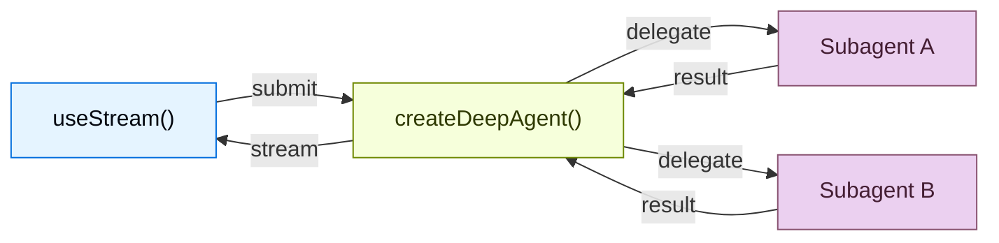

构建能够实时可视化 deep agent workflows 的 frontends。这些 patterns 展示如何从使用 `createDeepAgent` 创建的 agents 中，渲染 subagent progress、task planning、streaming content，以及类似 IDE 的 sandbox experiences。

## 架构 {#architecture}

Deep Agents 使用 coordinator-worker architecture。main agent 规划任务并 delegate 给 specialized subagents，每个 subagent 都隔离运行。在 frontend 中，`useStream` 会暴露 coordinator 的 messages，以及每个 subagent 的 streaming state。



:::python

```python
from deepagents import create_deep_agent

agent = create_deep_agent(
    model="google_genai:gemini-3.5-flash",
    tools=[get_weather],
    system_prompt="You are a helpful assistant",
    subagents=[
        {
            "name": "researcher",
            "description": "Research assistant",
        }
    ],
)
```

:::

:::js

```ts
import { createDeepAgent } from "deepagents";

const agent = createDeepAgent({
  tools: [getWeather],
  system: "You are a helpful assistant",
  subagents: [
    {
      name: "researcher",
      description: "Research assistant",
    },
  ],
});
```

:::

在 frontend 中，用与 `createAgent` 相同的方式连接 `useStream`。Deep agent patterns 会使用更多 `useStream` features，例如 `stream.subagents`、`stream.values.todos` 和 `filterSubagentMessages`，用于渲染 subagent-specific UIs。

```ts
import { useStream } from "@langchain/react";

function App() {
  const stream = useStream<typeof agent>({
    apiUrl: "http://localhost:2024",
    assistantId: "agent",
  });

  // Deep agent state beyond messages
  const todos = stream.values?.todos;
  const subagents = stream.subagents;
}
```

## 模式 {#patterns}

<CardGroup cols={3}>
  <Card title="Subagent 流式传输" icon="arrows-split" href="/oss/deepagents/frontend/subagent-streaming">
    显示 specialist subagents，包括流式内容、进度跟踪和可折叠卡片。
  </Card>
  <Card title="Todo 列表" icon="list-check" href="/oss/deepagents/frontend/todo-list">
    用从 agent state 同步的实时 todo 列表跟踪 agent 进度。
  </Card>
  <Card title="Sandbox" icon="code" href="/oss/deepagents/frontend/sandbox">
    构建由 sandbox 支撑的类 IDE UI，包括文件浏览器、代码查看器和 diff 面板。
  </Card>
</CardGroup>

## 相关模式 {#related-patterns}

[LangChain frontend patterns](/oss/langchain/frontend/overview) 中的 markdown messages、tool calling 和 human-in-the-loop 等模式，也都适用于 deep agents。Deep Agents 构建在同一个 LangGraph runtime 之上，因此 `useStream` 提供相同的核心 API。
