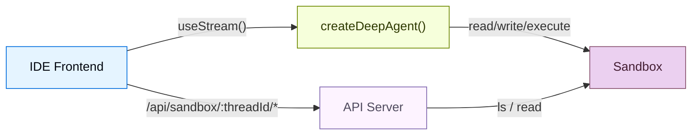
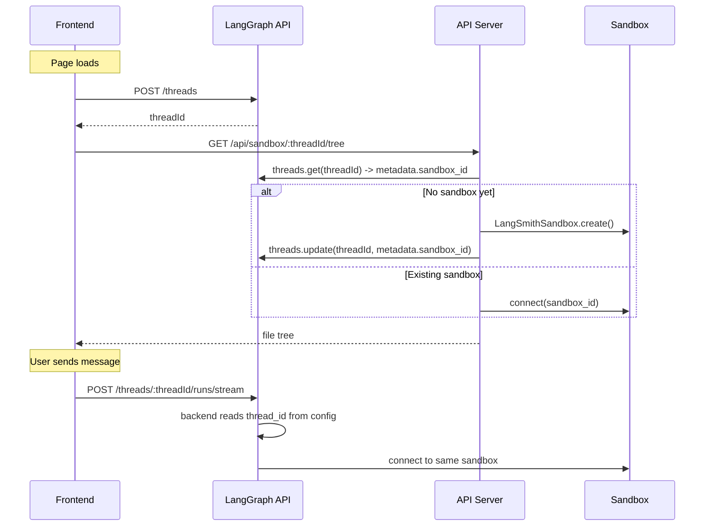

Coding agents 需要的不只是 chat window。它们需要 file browser、code viewer 和 diff panel，也就是一种 IDE experience。这个 pattern 会把 deep agent 连接到 [sandbox](/oss/deepagents/sandboxes)，让它可以在 isolated environment 中 read、write 和 execute code，然后通过 custom API server 暴露 sandbox filesystem，让 frontend 可以在 agent 工作时实时显示 files。

import { PatternEmbed } from "/snippets/pattern-embed.jsx";

<PatternEmbed pattern="deep-agent-ide" minHeight={700} />

## 架构 {#architecture}

sandbox pattern 有三层：

1. **带 sandbox backend 的 deep agent：** agent 会自动从 sandbox 获取 filesystem tools（`read_file`、`write_file`、`edit_file`、`execute`）

:::python

2. **Custom API server** - 通过 `langgraph.json` 的 `http.app` field 暴露的 FastAPI app，提供 frontend 可以调用的 file browsing endpoints

:::

:::js

2. **Custom API server：** 通过 `langgraph.json` 的 `http.app` field 暴露的 Hono app，提供 frontend 可以调用的 file browsing endpoints

:::

3. **IDE frontend：** 一个三面板 layout（file tree、code/diff viewer、chat），会在 agent 修改 files 时实时同步



## Sandbox 生命周期 {#sandbox-lifecycle}

在深入代码之前，先理解 sandboxes 如何 scoped 很重要。scoping strategy 会决定谁共享 sandbox、sandbox 存活多久，以及 runtime 中如何解析它。

### Thread-scoped sandbox（推荐） {#thread-scoped-sandbox-recommended}

每个 LangGraph thread 都获得自己的 sandbox。sandbox ID 会存储在 thread metadata 中，并在 runtime 通过 `getConfig()` 解析。这是大多数 applications 推荐使用的方式：

- Conversations 相互隔离 - 一个 thread 中的 file changes 不会影响另一个 thread
- Sandbox state 会跨 page reloads 保留（同一个 thread = 同一个 sandbox）
- Cleanup 很直接：删除 thread 时，也可以删除它的 sandbox



### Agent-scoped sandbox

同一个 assistant 下的所有 threads 共享一个 sandbox。适合 persistent project environments，也就是你希望 changes 能跨 conversations 保留的场景：

:::python

```python
from langgraph.config import get_config

def get_sandbox_backend_for_assistant():
    config = get_config()
    assistant_id = config.get("metadata", {}).get("assistant_id")
    return get_or_create_sandbox_for_assistant(assistant_id)
```

:::

:::js

```ts
import { getConfig } from "@langchain/langgraph";

function getSandboxBackendForAssistant() {
  const config = getConfig();
  const assistantId = config.metadata?.assistant_id;
  return getOrCreateSandboxForAssistant(assistantId);
}
```

:::

### User-scoped sandbox

每个 user 在所有 threads 中拥有自己的 sandbox。这需要 custom authentication 和 user identification：

:::python

```python
from langgraph.config import get_config

def get_sandbox_backend_for_user():
    config = get_config()
    user_id = config.get("configurable", {}).get("user_id")
    return get_or_create_sandbox_for_user(user_id)
```

:::

:::js

```ts
import { getConfig } from "@langchain/langgraph";

function getSandboxBackendForUser() {
  const config = getConfig();
  const userId = config.configurable?.user_id;
  return getOrCreateSandboxForUser(userId);
}
```

:::

### Session-scoped sandbox（client-side） {#session-scoped-sandbox-client-side}

对于没有 LangGraph threads 的简单 apps，frontend 可以生成一个 session ID 并直接传入。这种方式不会跨 browser sessions 持久化，最适合 demos 或 prototyping：

:::python

```python
import uuid
import urllib.parse
import urllib.request

session_id = str(uuid.uuid4())
query = urllib.parse.urlencode({"sessionId": session_id})
urllib.request.urlopen(f"http://localhost:2024/api/sandbox/tree?{query}")
```

:::

:::js

```ts
const sessionId = crypto.randomUUID();
fetch(`/api/sandbox/tree?sessionId=${sessionId}`);
```

:::

本指南剩余部分会以 **thread-scoped sandboxes** 作为主要示例。

## 设置 agent {#setting-up-the-agent}

### 选择 sandbox provider {#choose-a-sandbox-provider}

:::python

Deep Agents 支持多个 [sandbox providers](/oss/integrations/sandboxes)。任何实现 `SandboxBackendProtocol` 的 provider 都可以使用：

```python
from deepagents import create_deep_agent
from deepagents.sandbox import LangSmithSandbox  # or DaytonaSandbox, etc.

sandbox = LangSmithSandbox.create()
agent = create_deep_agent(model="google_genai:gemini-3.5-flash", backend=sandbox)
```

:::

:::js

Deep Agents 支持多个 sandbox providers。任何实现 `SandboxBackendProtocol` 的 provider 都可以使用：

```ts
import { createDeepAgent, LangSmithSandbox } from "deepagents";

const sandbox = await LangSmithSandbox.create();

export const agent = createDeepAgent({
  model: "google_genai:gemini-3.5-flash",
  backend: sandbox,
  systemPrompt: "You are an expert developer working on a project in /app.",
});
```

:::

agent 会自动获得 filesystem tools（`read_file`、`write_file`、`edit_file`、`ls`、`glob`、`grep`），以及用于运行 shell commands 的 `execute` tool。不需要额外 tool configuration。

### 为每个 thread 解析 sandbox {#resolve-a-sandbox-per-thread}

不要在 module level 创建 sandbox（那会被所有 threads 共享，而且可能过期），而是在 runtime 为每个 thread 解析 sandbox。sandbox 会通过 `getConfig()` 从 LangGraph config 中读取 `thread_id`：

:::js

```ts
import { createDeepAgent, LangSmithSandbox } from "deepagents";
import { getConfig } from "@langchain/langgraph";

async function getOrCreateSandboxForThread(threadId: string): Promise<LangSmithSandbox> {
  // Check thread metadata for existing sandbox_id
  const client = new Client({ apiUrl: "http://localhost:2024" });
  const thread = await client.threads.get(threadId);
  const sandboxId = thread.metadata?.sandbox_id;

  if (sandboxId) {
    // Reconnect to existing sandbox
    return new LangSmithSandbox({
      sandbox: await new SandboxClient().getSandbox(sandboxId),
    });
  }

  // Create new sandbox and store ID in thread metadata
  const sandbox = await LangSmithSandbox.create({ templateName: "my-template" });
  await seedSandbox(sandbox);
  await client.threads.update(threadId, { metadata: { sandbox_id: sandbox.id } });
  return sandbox;
}

// Create a sandbox that resolves per-thread at runtime
const sandbox = new LangSmithSandbox({
  resolve: async () => {
    const config = getConfig();
    const threadId = config.configurable?.thread_id;
    if (!threadId) throw new Error("No thread_id - agent must run on a thread");
    return getOrCreateSandboxForThread(threadId);
  },
});

export const agent = createDeepAgent({
  model: "google_genai:gemini-3.5-flash",
  backend: sandbox,
  systemPrompt: "You are an expert developer working on a project in /app.",
});
```

:::

:::python

```python
from deepagents import create_deep_agent
from deepagents.sandbox import LangSmithSandbox
from langgraph.config import get_config


def get_or_create_sandbox_for_thread(thread_id: str) -> LangSmithSandbox:
    # Look up or create sandbox based on thread_id
    ...


sandbox = LangSmithSandbox(
    resolve=lambda: get_or_create_sandbox_for_thread(
        get_config()["configurable"]["thread_id"]
    ),
)

agent = create_deep_agent(
    model="google_genai:gemini-3.5-flash",
    backend=sandbox,
)
```

:::

### 初始化 sandbox {#seed-the-sandbox}

在 agent 运行前，使用 `uploadFiles` 把 project files 填充到 sandbox 中：

<Info>
  对于 **LangSmith** sandboxes，container image 和 resource limits 来自
  [sandbox snapshot](/langsmith/sandbox-snapshots)。创建 sandbox 时传入 `templateName`，
:::python
  参见上面的 `get_or_create_sandbox_for_thread`。`upload_files` 会在 runtime 基于该 image seed 或 update
:::
:::js
  参见上面的 `getOrCreateSandboxForThread`。`uploadFiles` 会在 runtime 基于该 image seed 或 update
:::
  project files。
</Info>

```ts
const SEED_FILES: Record<string, string> = {
  "package.json": JSON.stringify({ name: "my-app", version: "1.0.0" }, null, 2),
  "src/index.js": 'console.log("Hello");',
};

const encoder = new TextEncoder();
await sandbox.uploadFiles(
  Object.entries(SEED_FILES).map(([path, content]) => [`/app/${path}`, encoder.encode(content)]),
);
```

<Tip>
  上传 `package.json` 后运行 `sandbox.execute("cd /app && npm install")`，以便在 agent 启动前安装 dependencies。
</Tip>

## 添加 file browsing API {#adding-the-file-browsing-api}

:::js

agent 可以 read 和 write files，但 frontend 也需要直接访问 sandbox filesystem 以便浏览。添加一个 custom [Hono](https://hono.dev) API server，并通过 `langgraph.json` 中的 `http.app` field 暴露它。

:::

:::python

agent 可以 read 和 write files，但 frontend 也需要直接访问 sandbox filesystem 以便浏览。添加一个 custom [FastAPI](https://fastapi.tiangolo.com) API server，并通过 `langgraph.json` 中的 `http.app` field 暴露它。

:::

### 创建 API server {#create-the-api-server}

sandbox API endpoints 使用 thread ID 作为 URL path parameter。这能确保 frontend 始终访问当前 conversation 对应的正确 sandbox，并使用与
:::python
agent backend 相同的 `get_or_create_sandbox_for_thread` function：
:::
:::js
agent backend 相同的 `getOrCreateSandboxForThread` function：
:::

:::js

```ts
// src/api/app.ts
import { Hono } from "hono";
import { getOrCreateSandboxForThread } from "./utils.js";

export const app = new Hono();

app.get("/api/sandbox/:threadId/tree", async (c) => {
  const threadId = c.req.param("threadId");
  const rootPath = c.req.query("filePath") || "/app";

  const sandbox = await getOrCreateSandboxForThread(threadId);
  const result = await sandbox.execute(
    `find '${rootPath}' -printf '%y\\t%s\\t%p\\n' 2>/dev/null | sort -t$'\\t' -k3`,
  );

  const entries = result.output
    .trim()
    .split("\n")
    .filter(Boolean)
    .map((line) => {
      const [typeChar, sizeStr, fullPath] = line.split("\t");
      return {
        name: fullPath.split("/").pop(),
        type: typeChar === "d" ? "directory" : "file",
        path: fullPath,
        size: parseInt(sizeStr, 10) || 0,
      };
    });

  return c.json({ path: rootPath, entries, sandboxId: sandbox.id });
});

app.get("/api/sandbox/:threadId/file", async (c) => {
  const threadId = c.req.param("threadId");
  const filePath = c.req.query("filePath");
  if (!filePath) return c.json({ error: "filePath is required" }, 400);

  const sandbox = await getOrCreateSandboxForThread(threadId);
  const results = await sandbox.downloadFiles([filePath]);
  const file = results[0];
  if (file.error) return c.json({ error: file.error }, 404);

  const content = new TextDecoder().decode(file.content!);
  return c.json({ path: filePath, content });
});
```

:::

:::python

```python
# src/api/server.py
from fastapi import FastAPI, Query, Path
from utils import get_or_create_sandbox_for_thread

app = FastAPI()

@app.get("/api/sandbox/{thread_id}/tree")
async def list_tree(
    thread_id: str = Path(...),
    path: str = Query("/app"),
):
    sandbox = await get_or_create_sandbox_for_thread(thread_id)
    result = await sandbox.aexecute(
        f"find {path} -printf '%y\\t%s\\t%p\\n' 2>/dev/null | sort"
    )
    entries = []
    for line in result.output.strip().split("\n"):
        if not line:
            continue
        type_char, size_str, full_path = line.split("\t")
        entries.append({
            "name": full_path.split("/")[-1],
            "type": "directory" if type_char == "d" else "file",
            "path": full_path,
            "size": int(size_str),
        })
    return {"path": path, "entries": entries, "sandbox_id": sandbox.id}

@app.get("/api/sandbox/{thread_id}/file")
async def read_file(
    thread_id: str = Path(...),
    path: str = Query(...),
):
    sandbox = await get_or_create_sandbox_for_thread(thread_id)
    results = await sandbox.adownload_files([path])
    return {"path": path, "content": results[0].content.decode()}
```

:::

<Note>
  agent backend 和 API server 都会调用同一个
:::python
  `get_or_create_sandbox_for_thread` function。这能确保它们总是为给定 thread 解析到
:::
:::js
  `getOrCreateSandboxForThread` function。这能确保它们总是为给定 thread 解析到
:::
  同一个 sandbox。thread metadata 中的 sandbox ID 是 single source of truth - 不需要 in-memory caches。
</Note>

### 配置 `langgraph.json` {#configure-langgraph-json}

同时注册 agent graph 和 API server。`http.app` field 会告诉 LangGraph platform，在默认 routes 旁边同时 serve 你的 custom routes：

:::js

```json
{
  "node_version": "22",
  "graphs": {
    "coding_agent": "./src/agents/my-agent.ts:agent"
  },
  "env": ".env",
  "http": {
    "app": "./src/api/app.ts:app"
  }
}
```

:::

:::python

```json
{
  "graphs": {
    "coding_agent": "./src/agents/my_agent.py:agent"
  },
  "env": ".env",
  "http": {
    "app": "./src/api/server.py:app"
  }
}
```

:::

你的 custom routes 会在与 LangGraph API 相同的 host 上可用。使用 `langgraph dev` 做 local development 时，也就是 `http://localhost:2024`。

<Note>
  在 `http.app` 中定义的 custom routes 优先级高于默认 LangGraph routes。这意味着你可以在需要时 shadow built-in endpoints，但要小心不要意外覆盖 `/threads` 或 `/runs` 这样的 routes。
</Note>

## 构建 frontend {#building-the-frontend}

frontend 有三个 panels：file tree sidebar、code/diff viewer 和 chat panel。它使用 `useStream` 进行 agent conversation，并使用 custom API endpoints 浏览 files。

### 创建 thread {#thread-creation}

page loads 时创建 LangGraph thread，并把它的 ID 持久化到 `sessionStorage`，这样 page reloads 后可以重新连接到同一个 sandbox：

```tsx
const THREAD_KEY = "sandbox-thread-id";

function IDEPreview() {
  const [threadId, setThreadId] = useState<string | null>(
    () => sessionStorage.getItem(THREAD_KEY),
  );

  const updateThreadId = useCallback((id: string | null) => {
    setThreadId(id);
    if (id) sessionStorage.setItem(THREAD_KEY, id);
    else sessionStorage.removeItem(THREAD_KEY);
  }, []);

  const stream = useStream<typeof myAgent>({
    apiUrl: AGENT_URL,
    assistantId: "coding_agent",
    threadId,
    onThreadId: updateThreadId,
  });

  // Create thread on first mount
  useEffect(() => {
    if (threadId) return;
    stream.client.threads.create().then((t) => updateThreadId(t.thread_id));
  }, [stream.client, threadId, updateThreadId]);

  // Pass threadId to sandbox file hooks
  const { tree, files } = useSandboxFiles(threadId);
  // ...
}
```

“new thread” button 会清除已存储的 ID，让下一次 mount 创建一个全新的 thread（以及 sandbox）：

```tsx
function handleNewThread() {
  stream.switchThread(null);
  updateThreadId(null);
}
```

### 文件状态管理 {#file-state-management}

跟踪 sandbox filesystem 的两个 snapshots：original state（agent 运行前）和 current state（实时更新）。API URL 中包含 thread ID，因此 requests 总是命中正确的 sandbox：

```ts
const AGENT_URL = "http://localhost:2024";

async function fetchTree(threadId: string): Promise<FileEntry[]> {
  const res = await fetch(
    `${AGENT_URL}/api/sandbox/${encodeURIComponent(threadId)}/tree?filePath=/app`,
  );
  const data = await res.json();
  return data.entries.filter((e: FileEntry) => !e.path.includes("node_modules"));
}

async function fetchFile(threadId: string, path: string): Promise<string | null> {
  const res = await fetch(
    `${AGENT_URL}/api/sandbox/${encodeURIComponent(threadId)}/file?filePath=${encodeURIComponent(path)}`,
  );
  const data = await res.json();
  return data.content ?? null;
}
```

### 实时文件同步 {#real-time-file-sync}

IDE experience 的关键在于 **agent 工作时** 就更新 files，而不是等它完成后再更新。监听 stream messages 中来自 file-mutating tools 的 `ToolMessage` instances。当 `write_file` 或 `edit_file` tool call 完成时，刷新对应 file。当 `execute` 完成时，刷新全部内容（因为 shell command 可能修改任意 file）：

<CodeGroup>
```tsx React
import { useStream } from "@langchain/react";
import { ToolMessage, AIMessage } from "langchain";

const FILE_MUTATING_TOOLS = new Set(["write_file", "edit_file", "execute"]);

export function IDEPreview() {
  const stream = useStream<typeof myAgent>({
    apiUrl: AGENT_URL,
    assistantId: "coding_agent",
  });

  const processedIds = useRef(new Set<string>());

  useEffect(() => {
    // Build a map of file-mutating tool calls from AI messages
    const toolCallMap = new Map();
    for (const msg of stream.messages) {
      if (!AIMessage.isInstance(msg)) continue;
      for (const tc of msg.tool_calls ?? []) {
        if (tc.id && FILE_MUTATING_TOOLS.has(tc.name)) {
          toolCallMap.set(tc.id, { name: tc.name, args: tc.args });
        }
      }
    }

    // When a ToolMessage appears for a file-mutating tool, refresh
    for (const msg of stream.messages) {
      if (!ToolMessage.isInstance(msg)) continue;
      const id = msg.id ?? msg.tool_call_id;
      if (!id || processedIds.current.has(id)) continue;

      const call = toolCallMap.get(msg.tool_call_id);
      if (!call) continue;
      processedIds.current.add(id);

      if (call.name === "write_file" || call.name === "edit_file") {
        refreshSingleFile(call.args.path);
      } else if (call.name === "execute") {
        refreshAllFiles();
      }
    }
  }, [stream.messages]);
}
```

```vue Vue
<script setup lang="ts">
import { useStream } from "@langchain/vue";
import { ToolMessage, AIMessage } from "langchain";
import { watch } from "vue";

const FILE_MUTATING_TOOLS = new Set(["write_file", "edit_file", "execute"]);
const processedIds = new Set<string>();

const stream = useStream<typeof myAgent>({
  apiUrl: AGENT_URL,
  assistantId: "coding_agent",
});

watch(
  () => stream.messages.value,
  (messages) => {
    const toolCallMap = new Map();
    for (const msg of messages) {
      if (AIMessage.isInstance(msg)) {
        for (const tc of msg.tool_calls ?? []) {
          if (tc.id && FILE_MUTATING_TOOLS.has(tc.name)) {
            toolCallMap.set(tc.id, { name: tc.name, args: tc.args });
          }
        }
      }
    }

    for (const msg of messages) {
      if (!ToolMessage.isInstance(msg)) continue;
      const id = msg.id ?? msg.tool_call_id;
      if (!id || processedIds.has(id)) continue;

      const call = toolCallMap.get(msg.tool_call_id);
      if (!call) continue;
      processedIds.add(id);

      if (call.name === "write_file" || call.name === "edit_file") {
        refreshSingleFile(call.args.path);
      } else if (call.name === "execute") {
        refreshAllFiles();
      }
    }
  },
  { deep: true },
);
</script>
````

```svelte Svelte
<script lang="ts">
  import { useStream } from "@langchain/svelte";
  import { ToolMessage, AIMessage } from "langchain";

  const FILE_MUTATING_TOOLS = new Set(["write_file", "edit_file", "execute"]);
  const processedIds = new Set<string>();

  const { messages, submit } = useStream<typeof myAgent>({
    apiUrl: AGENT_URL,
    assistantId: "coding_agent",
  });

  $effect(() => {
    const msgs = $messages;
    const toolCallMap = new Map();
    for (const msg of msgs) {
      if (AIMessage.isInstance(msg)) {
        for (const tc of msg.tool_calls ?? []) {
          if (tc.id && FILE_MUTATING_TOOLS.has(tc.name)) {
            toolCallMap.set(tc.id, { name: tc.name, args: tc.args });
          }
        }
      }
    }

    for (const msg of msgs) {
      if (!ToolMessage.isInstance(msg)) continue;
      const id = msg.id ?? msg.tool_call_id;
      if (!id || processedIds.has(id)) continue;

      const call = toolCallMap.get(msg.tool_call_id);
      if (!call) continue;
      processedIds.add(id);

      if (call.name === "write_file" || call.name === "edit_file") {
        refreshSingleFile(call.args.path);
      } else if (call.name === "execute") {
        refreshAllFiles();
      }
    }
  });
</script>
```

```ts Angular
import { Component, effect } from "@angular/core";
import { useStream } from "@langchain/angular";
import { ToolMessage, AIMessage } from "langchain";

const FILE_MUTATING_TOOLS = new Set(["write_file", "edit_file", "execute"]);

@Component({
  selector: "app-ide-preview",
  template: `<!-- ... -->`,
})
export class IdePreviewComponent {
  stream = useStream<typeof myAgent>({
    apiUrl: AGENT_URL,
    assistantId: "coding_agent",
  });

  private processedIds = new Set<string>();

  constructor() {
    effect(() => {
      const messages = this.stream.messages();
      const toolCallMap = new Map();
      for (const msg of messages) {
        if (AIMessage.isInstance(msg)) {
          for (const tc of (msg as AIMessage).tool_calls ?? []) {
            if (tc.id && FILE_MUTATING_TOOLS.has(tc.name)) {
              toolCallMap.set(tc.id, { name: tc.name, args: tc.args });
            }
          }
        }
      }

      for (const msg of messages) {
        if (!ToolMessage.isInstance(msg)) continue;
        const id = (msg as ToolMessage).id ?? (msg as ToolMessage).tool_call_id;
        if (!id || this.processedIds.has(id)) continue;

        const call = toolCallMap.get((msg as ToolMessage).tool_call_id);
        if (!call) continue;
        this.processedIds.add(id);

        if (call.name === "write_file" || call.name === "edit_file") {
          this.refreshSingleFile(call.args.path);
        } else if (call.name === "execute") {
          this.refreshAllFiles();
        }
      }
    });
  }
}
```

</CodeGroup>

### 检测变更文件 {#detecting-changed-files}

每次 agent run 前，对当前 file contents 做 snapshot。files 刷新后，把它与 snapshot 对比，找出哪些 files changed：

```ts
function detectChanges(current: FileSnapshot, original: FileSnapshot): Set<string> {
  const changed = new Set<string>();
  for (const [path, content] of Object.entries(current)) {
    if (original[path] !== content) changed.add(path);
  }
  for (const path of Object.keys(original)) {
    if (!(path in current)) changed.add(path);
  }
  return changed;
}
```

当 user 选择 changed file 时，默认进入 diff view，让他们立即看到 agent 修改了什么。

### 显示 diffs {#displaying-diffs}

使用适合对应 framework 的 diff library 来渲染 unified diffs：

| Framework | Library                                                                    | Component                                                       |
| --------- | -------------------------------------------------------------------------- | --------------------------------------------------------------- |
| React     | [`@pierre/diffs`](https://diffs.com)                                       | 使用 `parseDiffFromFile` 的 `<FileDiff>`                        |
| Vue       | [`@git-diff-view/vue`](https://github.com/MrWangJustToDo/git-diff-view)    | 使用 `@git-diff-view/file` 中 `generateDiffFile` 的 `<DiffView>` |
| Svelte    | [`@git-diff-view/svelte`](https://github.com/MrWangJustToDo/git-diff-view) | 使用 `@git-diff-view/file` 中 `generateDiffFile` 的 `<DiffView>` |
| Angular   | [`ngx-diff`](https://github.com/rars/ngx-diff)                             | 使用 `[before]` 和 `[after]` 的 `<ngx-unified-diff>`             |

使用 `@pierre/diffs` 的示例（React）：

```tsx
import { FileDiff } from "@pierre/diffs/react";
import { parseDiffFromFile } from "@pierre/diffs";

function DiffPanel({ original, current, fileName }) {
  const diff = parseDiffFromFile(
    { name: fileName, contents: original },
    { name: fileName, contents: current },
  );

  return (
    <FileDiff
      fileDiff={diff}
      options={{ theme: "github-dark", diffStyle: "unified", diffIndicators: "bars" }}
    />
  );
}
```

### 变更文件摘要 {#changed-files-summary}

显示所有 modified files 的 summary，并包含 line-level addition/deletion counts。这会让 users 快速了解 agent 造成的影响，类似 `git status`：

```tsx
function ChangedFilesSummary({ changedFiles, files, originalFiles, onSelect }) {
  const stats = [...changedFiles].map((path) => {
    const oldLines = (originalFiles[path] ?? "").split("\n");
    const newLines = (files[path] ?? "").split("\n");
    // Compute additions/deletions by comparing lines
    return { path, additions, deletions };
  });

  return (
    <div>
      <h3>{stats.length} Files Changed</h3>
      {stats.map((file) => (
        <button key={file.path} onClick={() => onSelect(file.path)}>
          {file.path}
          <span className="text-green-400">+{file.additions}</span>
          <span className="text-red-400">-{file.deletions}</span>
        </button>
      ))}
    </div>
  );
}
```

## 三栏布局 {#the-three-panel-layout}

IDE layout 会把三个面板并排排列：

| 面板 | 宽度 | 用途 |
| ----------- | ------------- | -------------------------------------------- |
| 文件树      | 固定 (208px) | 浏览 sandbox 文件，查看变更指示器           |
| Code / Diff | 弹性         | 查看文件内容或 unified diff                  |
| Chat        | 固定 (320px) | 与 agent 交互                                |

```tsx
<div className="flex h-screen">
  <div className="w-52 shrink-0">
    <FileTree />
    <ChangedFilesSummary />
  </div>

  <CodePanel /* flex-1 */ />

  <div className="w-80 shrink-0">
    <ChatPanel />
  </div>
</div>
```

file tree 会显示 VS Code-style icons（使用 [`@iconify-json/vscode-icons`](https://www.npmjs.com/package/@iconify-json/vscode-icons)），并在 modified files 上显示 amber dots。选择 modified file 会自动切换到 diff tab。

## 使用场景 {#use-cases}

以下场景适合使用 sandbox：

- **Coding agents**：创建、修改并运行 code 的 agents 需要超越 chat 的 visual interface
- **Code review workflows**：agent 建议 changes，user 在接受前 review diffs
- **Tutorial or learning apps**：AI assistant 帮助 users step by step 构建 project，并在 context 中展示 changes
- **Prototyping tools**：users 用 natural language 描述 features，并实时观看 agent 实现它们

## 最佳实践 {#best-practices}

- **Use thread-scoped sandboxes** 用于 production apps。把 sandbox ID 存储在 thread metadata 中，并在 runtime 通过 `getConfig()` 解析。这可以避免 module-level state，并让每个 conversation 的 sandboxes 保持隔离。
- **Share `getOrCreateSandboxForThread`** 于 agent backend 和 API server 之间。两者都应该以同样方式解析 sandbox，也就是通过 thread metadata，这样就有 single source of truth，不需要 in-memory caches。
- **Persist `threadId` in `sessionStorage`**，让 page reloads 重新连接到同一个 thread 和 sandbox，而不是创建新的。
- **Sync files on every relevant tool call**，而不只是等 run 完成。这会让 IDE 感觉是实时的。监听 `write_file`、`edit_file` 和 `execute` tool messages，并立即 refresh。
- **Default to diff view for changed files**。当 user 点击被 agent 修改过的 file 时，先显示 diff，这是他们最关心的内容。
- **Show compact tool results for read-only operations**。不要在 chat 里倾倒 `read_file` 的完整输出，而是显示类似 `Read router.js L1-42` 的一行摘要。完整输出展示应保留给 mutating tools。
- **Seed the sandbox with a real project**。从空 sandbox 开始会让人迷失。上传一个可运行的 starter project，让 users 和 agent 立即获得 context。
- **Filter `node_modules` from the file tree**。没有人想浏览成千上万个 dependency files。获取 tree 时把它们过滤掉。
